#                   Programación Avanzada 

## Introducción

### ¿Qué es Phyton?

Python es un lenguaje creado por Guido Van  Rossum a Principios de los años 1990. El lenguaje como tal responde a que tiene una sintais muy simple de usar el cual lo facilta para  principiantes . Se trata de un lenguaje de tipado o de script con tipado dinamico, multiplataforma y orientado a objetos.

Es un ejemplo de lenguaje de alto nive y guarda sus scripts con terminacion de archivo .py.

### ¿Qué es un lenguaje tipado o de script?

Aque que se ejecuta utilizando un programa intermedio , llamado interprete en lugrar de compilar el código o lenguaje  máquina que pueda comprender o ejecutar directamente una computadora.

### ¿Qué es el tipado dinámico?

No es necesario declarar el tipo de dato que va a contener una determinada variable , sino que su tipo se determinara en tiempo de ejecucion segun el tipo de valor al que se asigne y el tipo de esta variable puede cambiar si se le asigna el valor de otro tipo.

### ¿Qué es el fuertemente tipado?

No se permite tratar a una variable como si fuera de un tipo distinto al que se tiene, es necesario convertir de forma explicita dicha variable al nuevo tipo previamente.

### Multiplataforma

El interprete de Phython esta disponible en multitud de plataformas (Unix, Solaris, Linu, DOS, Windows, Mac OS, Android, IOS).Por lo que si no utilizamos librerias especificas de cada plataforma, nuestro programa podra correr en todos estos sistemas sin grandes cambios.

### ¿Qué significa orientado a objetos?

Es un paradigma de programación en el que los conceptos del mundo real relevantes para nuestro problema se trasladan a clases y objetos de nuestro programa.

### ¿Por qué Phyton?

Es un lenguaje que con su sintaxis simple, clara y sencilla, puede automatizar simples tareas como: mover y renombrar miles de archivos y clasificarlos en folders, llenar de forma automatica formularios en internet, descargar archivos o extraer información de páginas de internet de forma masiva, hacer que su computadora le envié información a su teléfono de quien la esta usando, checar su email y contestarlo de forma automática.

## Comandos

### print()

Imprime un mensaje en la pantalla o en otro dispositivo de salida. El mensaje puede ser una cadena de caracteres o cualquier objeto que sea convertible a cadena de caracteres

#### Ejemplo:

print('Hola')

### input()

Permite al usuario introducir información utiliando el teclado, la variable donde se guarda dicha info es del tipo string o cadena de caracteres.

input('Inserta tu edad: ')

### int

Convierte cualquier dato al tipo entero 

### float 

Convierte cualquier dato al tipo decimal 
# __________________________________________________________________________________________________________________________________
##               Introducción a los ejercicios de programación
# __________________________________________________________________________________________________________________________________

#### Ejercicios diseñados para desarrollar habilidades de análisis al practicar dividiendo pequeños problemas en secuencias de pasos. Además ayudará familiarizar con la sintaxis de Python. Para completar cada ejercicio, debe esperar usar algunas o todas estas características de Python:
#### • Generar salida con declaraciones impresas.
#### • Leer entrada, incluida la conversión de esa entrada al tipo apropiado.
#### • Realizar cálculos con números enteros y números de coma flotante usando Python con operadores como +, -, *, /, //,% y **.

### Ejercicio 1: Dirección de envió.

#### Un programa que muestra un remitente y un destinatario, a fin de que se visualize para imprimir en un sobre de correo.

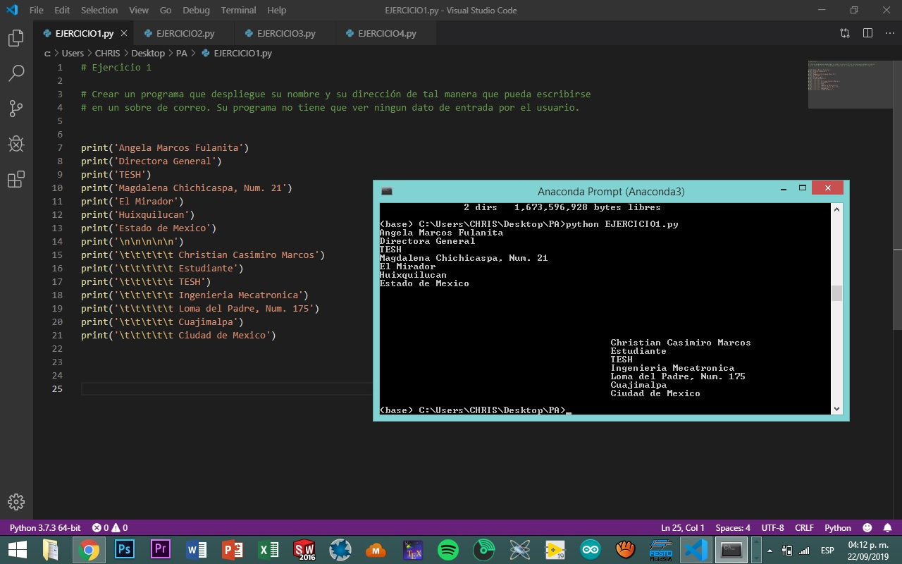 

##### Click para ver el código: https://github.com/CHRISTIANCMARCOS/progAvanzada/blob/master/EJERCICIO1.py  

### Ejercicio 2: Hola.

#### Un programa que le pide al usuario su nombre y le contesta hola.

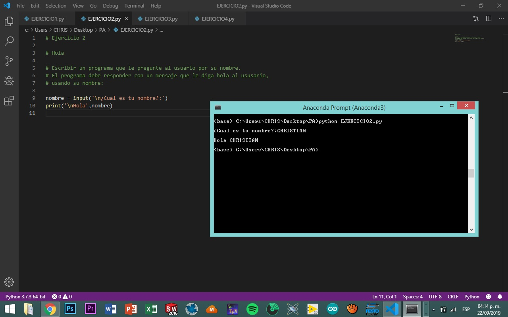

##### Click para ver el código: https://github.com/CHRISTIANCMARCOS/progAvanzada/blob/master/EJERCICIO2.py  

### Ejercicio 3: Área de una habitación.

#### Un programa que calcula el área, introduciendo el largo y el ancho en metros.

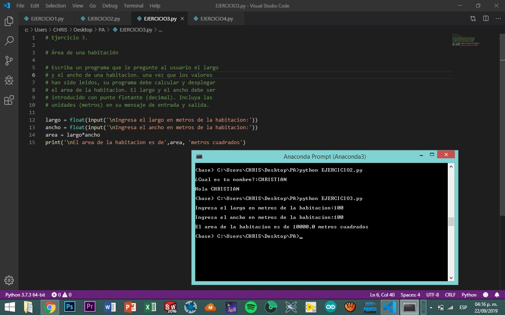

##### Click para ver el código: https://github.com/CHRISTIANCMARCOS/progAvanzada/blob/master/EJERCICIO3.py

### Ejercicio 4: Área de un campo.

#### Un programa que calcula el área de un campo y lo despliega en acres.

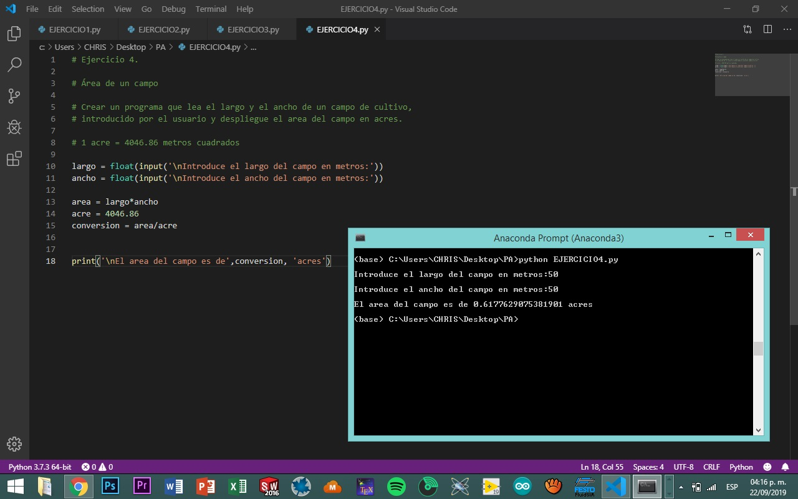

##### Click para ver el código: https://github.com/CHRISTIANCMARCOS/progAvanzada/blob/master/EJERCICIO4.py

### Ejercicio 5: Depositos de botellas.

#### Un programa que calcula el total de dolares de las botellas introducidas, ya sean chicas o grandes.

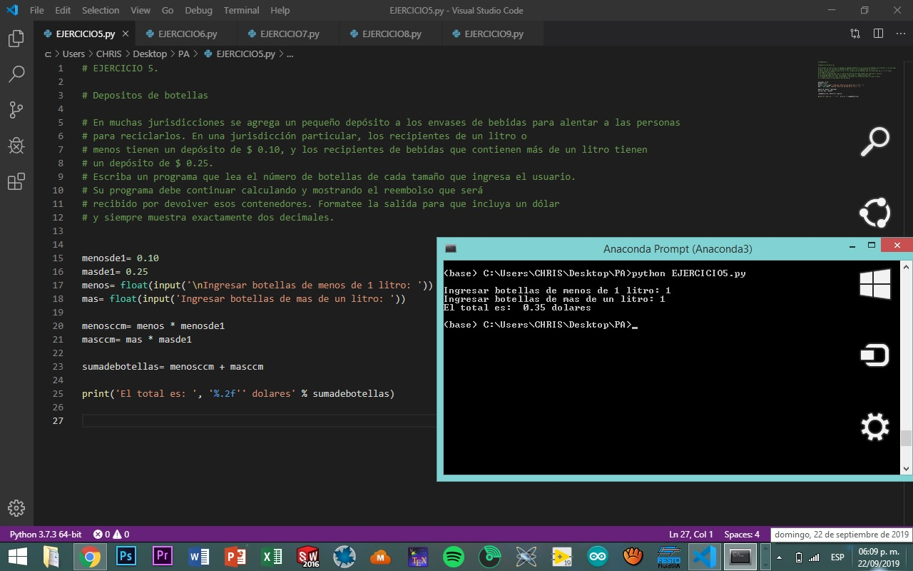

##### Click para ver el código: https://github.com/CHRISTIANCMARCOS/progAvanzada/blob/master/EJERCICIO5.py

### Ejercicio 6: Impuestos y propina.

#### Un programa que el ususario introduce sus alimentos y el precio, obteniendo el porcentaje de impuestos y propina del total de la cuenta.

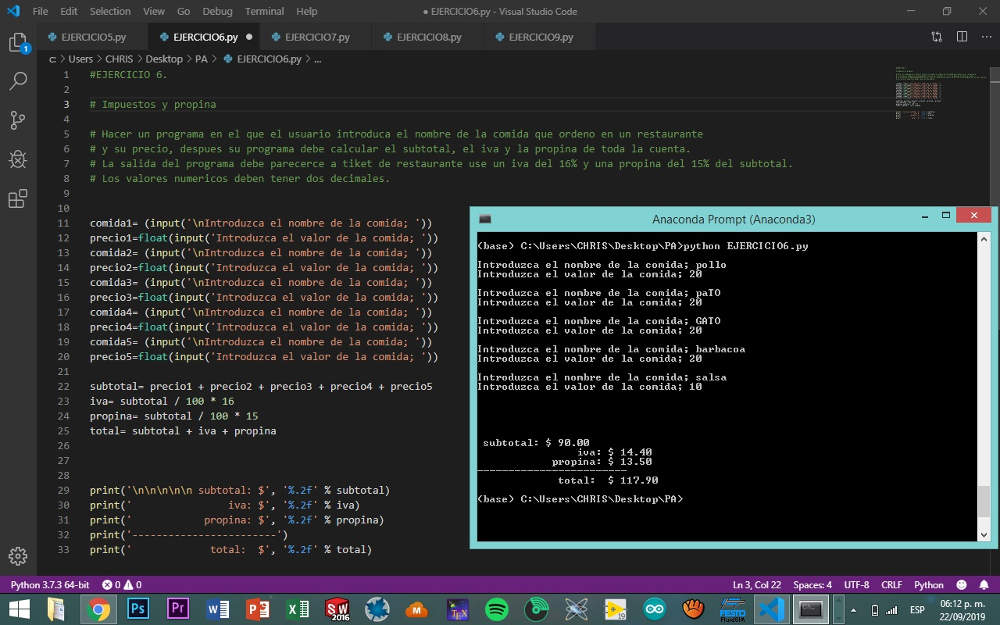

##### Click para ver el código: https://github.com/CHRISTIANCMARCOS/progAvanzada/blob/master/EJERCICIO6.py

### Ejercicio 7: Suma de los primeros numeros n enteros positivos.

#### Un programa que calcula la suma de los numeros enteros positivos de un numero.

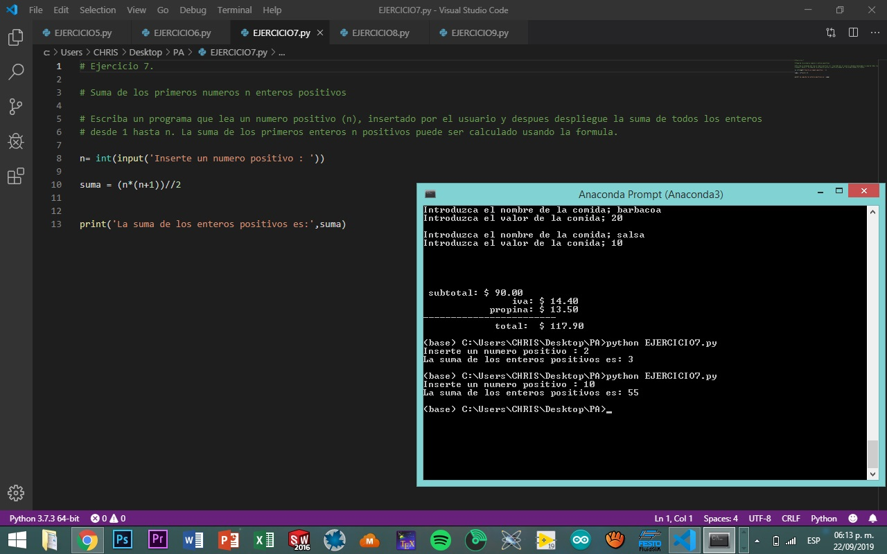

##### Click para ver el código: https://github.com/CHRISTIANCMARCOS/progAvanzada/blob/master/EJERCICIO7.py

### Ejercicio 8: Cajas de cereal.

#### Un programa que calcula el peso de las cajas de cereal introducidas por el ususario.

##### Click para ver el código: https://github.com/CHRISTIANCMARCOS/progAvanzada/blob/master/EJERCICIO8.py

### Ejercicio 9: Interés compuesto.

#### Un programa que calcula el interes del estado de cuenta para tres años de un usuario.

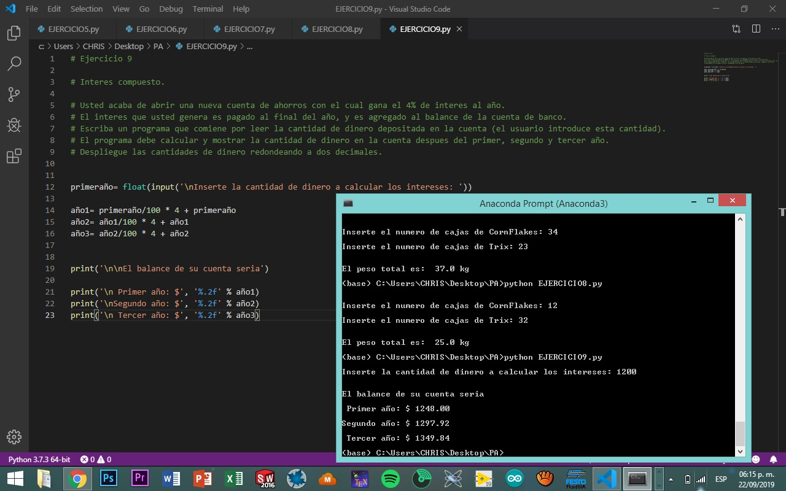

##### Click para ver el código: https://github.com/CHRISTIANCMARCOS/progAvanzada/blob/master/EJERCICIO9.py

### Ejercicio 10: Aritmética.

#### Un programa que calcula operaciones básicas con dos variables.

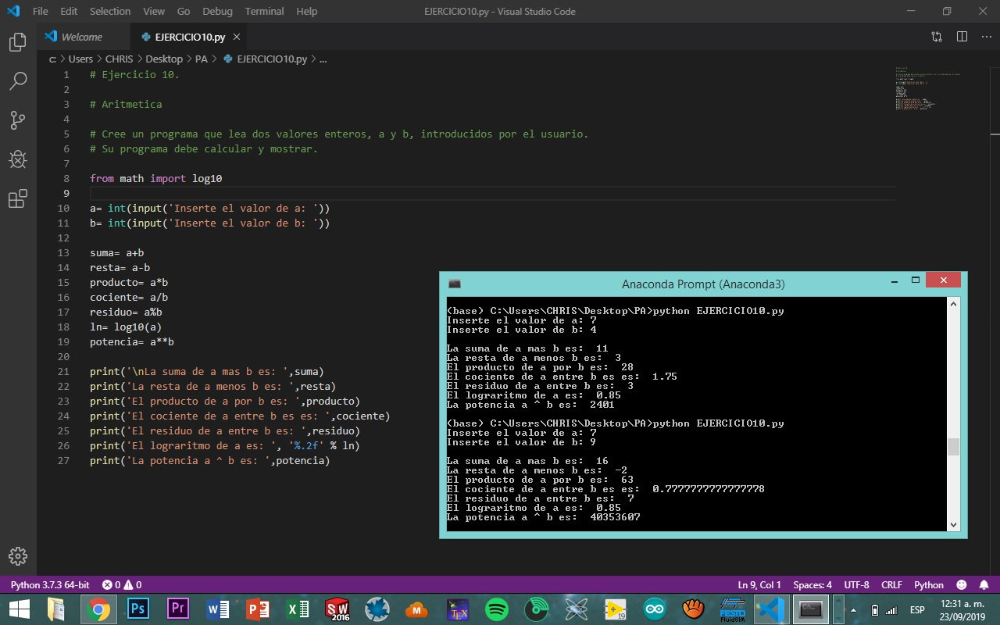

##### Click para ver el código: https://github.com/CHRISTIANCMARCOS/progAvanzada/blob/master/EJERCICIO10.py

### Ejercicio 11: Eficiencia de combustible.

#### Un convertidor de eficiencia de EUA (MPG) a unidades Mexicanas (L/100km).

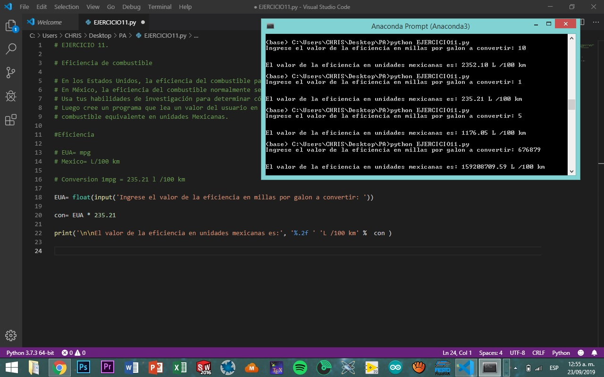

##### Click para ver el código: https://github.com/CHRISTIANCMARCOS/progAvanzada/blob/master/EJERCICIO11.py

### Ejercicio 12: Distancia entre dos puntos en la Tierra. 

#### La distancia entre dos puntos de la tierra ingresando los valores en grados. 

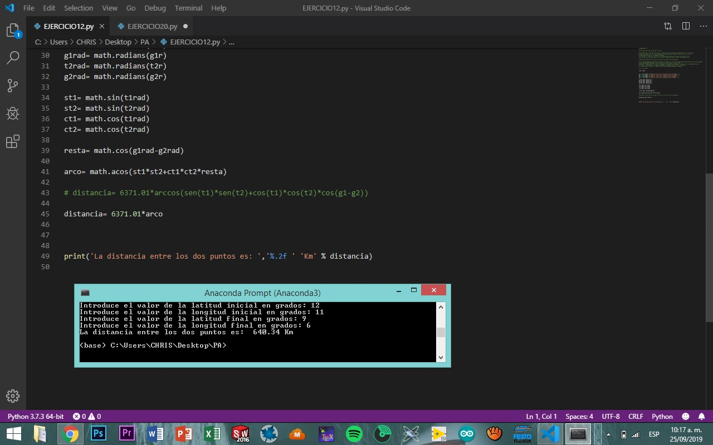

##### Click para ver el código: https://github.com/CHRISTIANCMARCOS/progAvanzada/blob/master/EJERCICIO12.py

### Ejercicio 13: Haciendo el cambio. 

#### Un programa que lee, la cantidad de centavos como entero y calcula las denominaciones de monedas que deberían usarse para dar esa cantidad de cambio. El cambio debe administrarse utilizando la menor cantidad de monedas posible.  

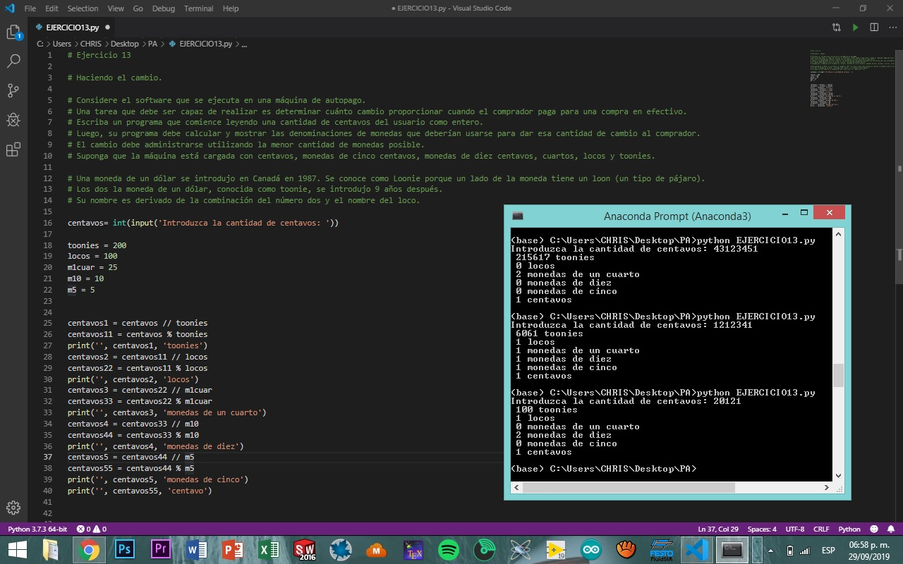

##### Click para ver el código: https://github.com/CHRISTIANCMARCOS/progAvanzada/blob/master/EJERCICIO13.py

### Ejercicio 14: Unidades de altura. 

#### Un programa que lee un número de pies, seguido de varias pulgadas. Una vez que se lee estos valores, su programa debe calcular y mostrar el número equivalente de centímetros.

##### Click para ver el código: https://github.com/CHRISTIANCMARCOS/progAvanzada/blob/master/EJERCICIO14.py

### Ejercicio 15: Unidades de distancia. 

#### Un programa que comienza leyendo una medida en pies. Entonces el programa debe mostrar la distancia equivalente en pulgadas, yardas y millas.

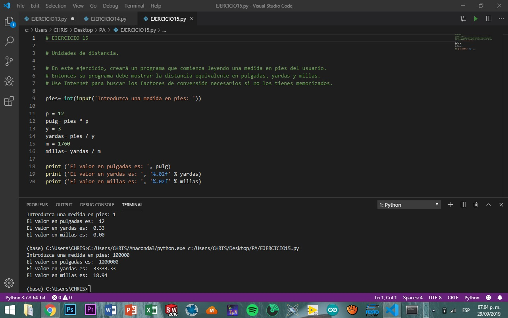

##### Click para ver el código: https://github.com/CHRISTIANCMARCOS/progAvanzada/blob/master/EJERCICIO15.py

### Ejercicio 16: Área y Volumen. 

#### Un programa que lee un radio. El programa calcula y muestra el área de un círculo con radio r y el volumen de una esfera.

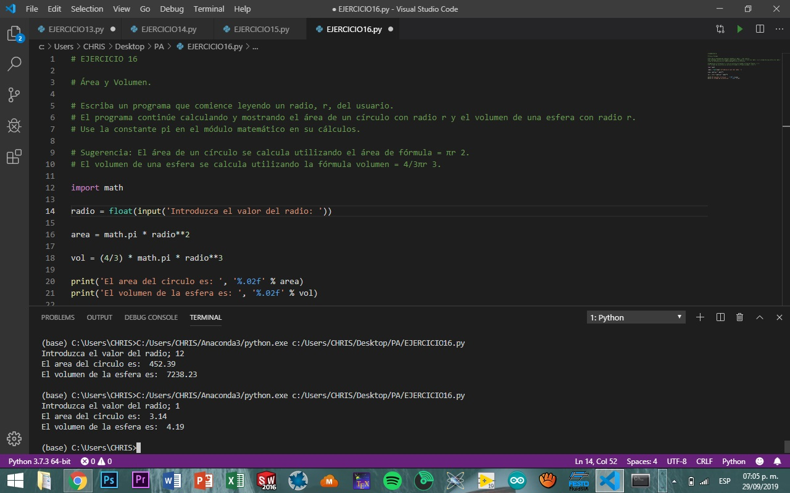

##### Click para ver el código: https://github.com/CHRISTIANCMARCOS/progAvanzada/blob/master/EJERCICIO16.py

### Ejercicio 17: Capacidad calorífica. 

#### Un programa que lee la masa de un poco de agua y el cambio de temperatura. El programa debe mostrar la cantidad total de energía que debe ser agregado o eliminado para lograr el cambio de temperatura deseado, también calcula el costo de calentar el agua. 

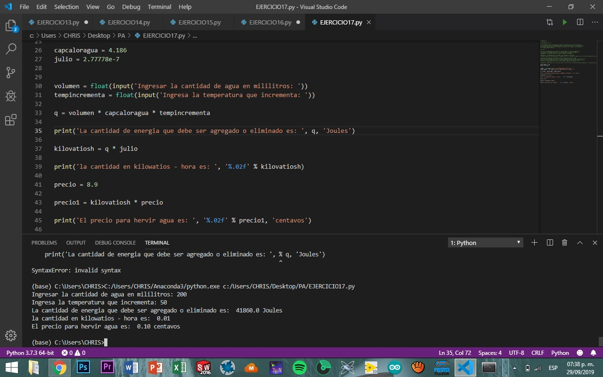

##### Click para ver el código: https://github.com/CHRISTIANCMARCOS/progAvanzada/blob/master/EJERCICIO17.py

### Ejercicio 18: Volumen de un cilindro. 

#### Un programa que lee el radio del cilindro, junto con su altura  y calcula su volumen.

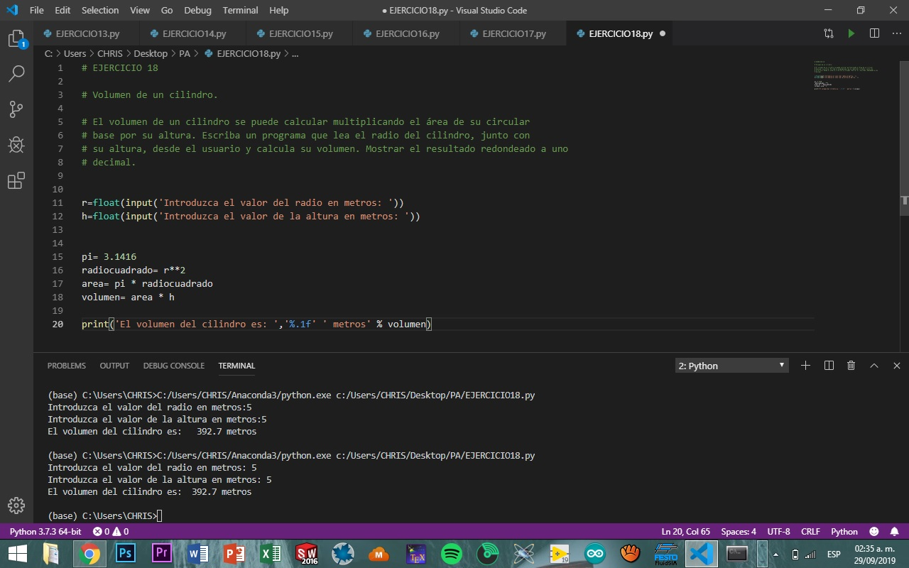

##### Click para ver el código: https://github.com/CHRISTIANCMARCOS/progAvanzada/blob/master/EJERCICIO18.py

### Ejercicio 19: Caida libre. 

#### Un programa que calcula la velocidad final de un objeto con referente a una altura.  

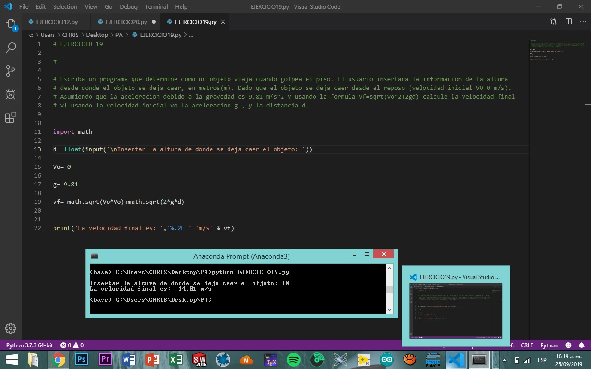

##### Click para ver el código: https://github.com/CHRISTIANCMARCOS/progAvanzada/blob/master/EJERCICIO19.py

### Ejercicio 20: Ley del gas ideal. 

#### Un programa que calcula la cantidad de gas en moles cuando el usuario suministra la presión, el volumen y la temperatura.  

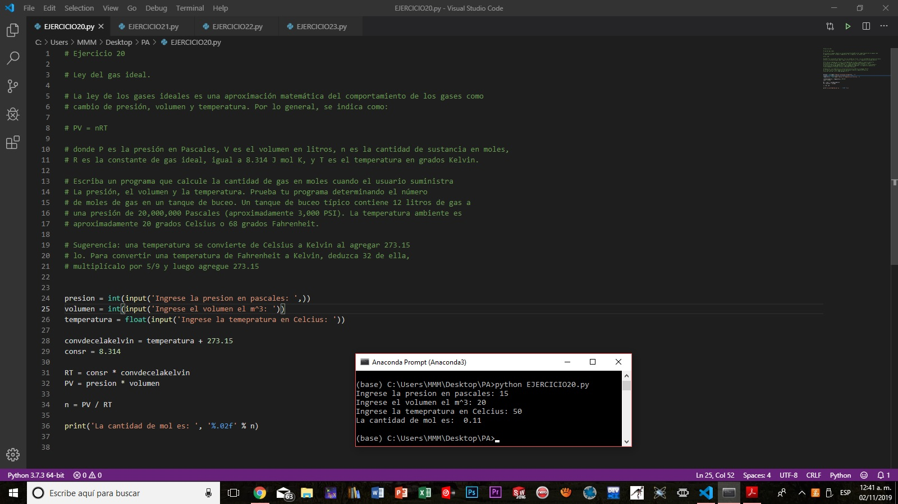

##### Click para ver el código: https://github.com/CHRISTIANCMARCOS/progAvanzada/blob/master/EJERCICIO20.py

### Ejercicio 21: Área de un triángulo.  

#### Un programa que permite al usuario ingresar valores para b y h. El programa luego debe calcular y mostrar el área de un triángulo con longitud base b y altura h.  

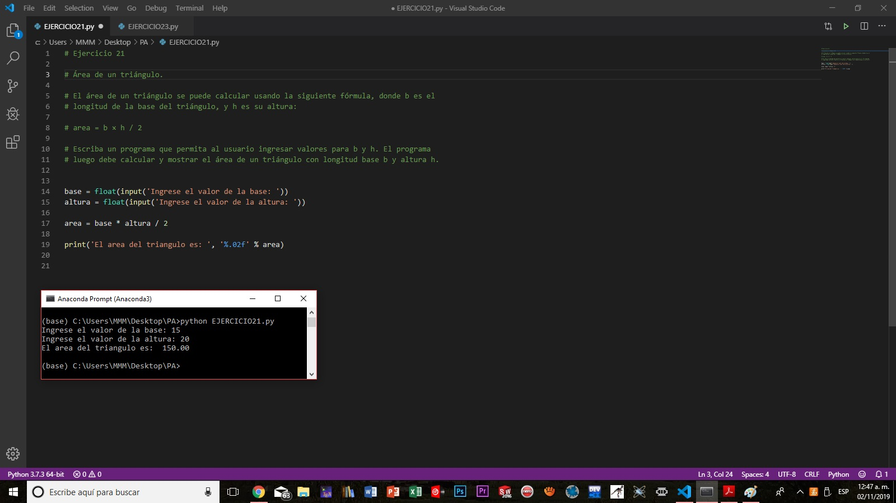

##### Click para ver el código: https://github.com/CHRISTIANCMARCOS/progAvanzada/blob/master/EJERCICIO21.py

### Ejercicio 22: Área de un triángulo (de nuevo). 

#### El área del triángulo se puede calcular usando una fórmula.

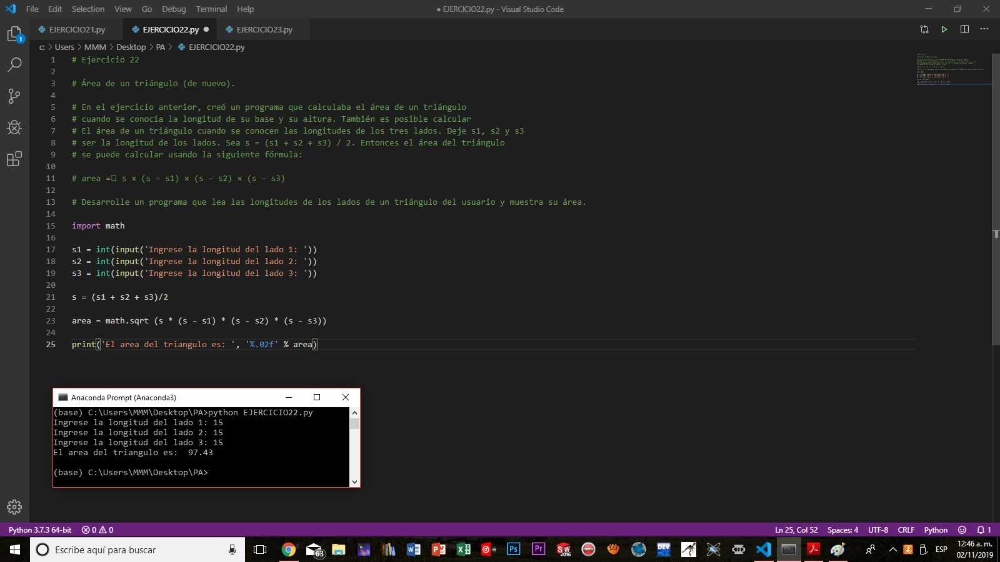

##### Click para ver el código: https://github.com/CHRISTIANCMARCOS/progAvanzada/blob/master/EJERCICIO22.py

### Ejercicio 23: Área de un polígono regular.  

#### El área de un polígono regular se puede calcular usando una fórmula, donde s es la longitud de un lado y n es el número de lados. 

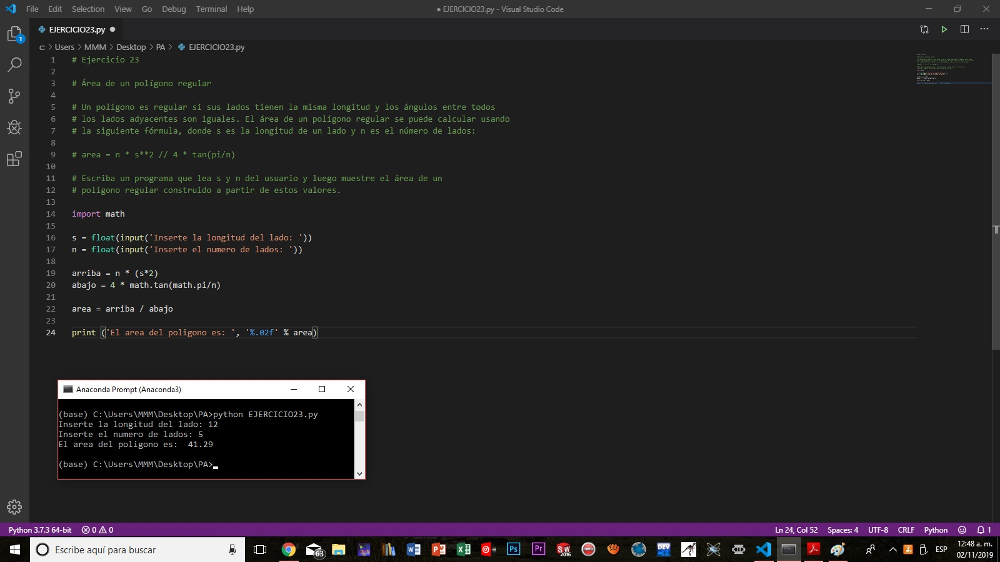

##### Click para ver el código: https://github.com/CHRISTIANCMARCOS/progAvanzada/blob/master/EJERCICIO23.py

### Ejercicio 24: Unidades de tiempo.  

#### Un programa que pide la duración de días, horas, minutos y segundos que calcula y desplega la cantidad total de segundos de duración.  
 
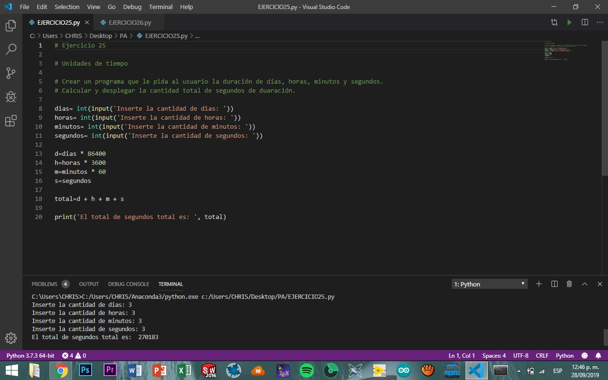

##### Click para ver el código: https://github.com/CHRISTIANCMARCOS/progAvanzada/blob/master/EJERCICIO24.py

### Ejercicio 25: Unidades de tiempo 2.   

#### Un programa que comienza por leer una cantidad de segundos introducidos. El programa debe despliega la cantidad equivalente en la forma de DD:HH:MM:SS, donde DD son los dias, HH son las horas, MM son los minutos y SS son los segundos.  

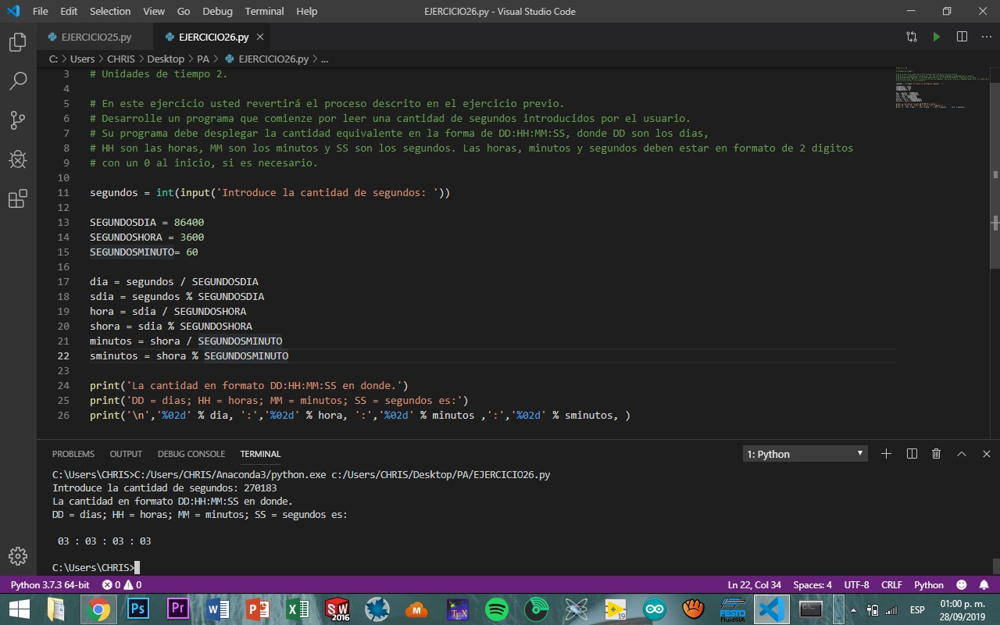

##### Click para ver el código: https://github.com/CHRISTIANCMARCOS/progAvanzada/blob/master/EJERCICIO25.py

### Ejercicio 26: Tiempo actual. 

#### Un programa que muestra la hora y fecha actuales. El programa no requiere ninguna entrada de el usuario.  

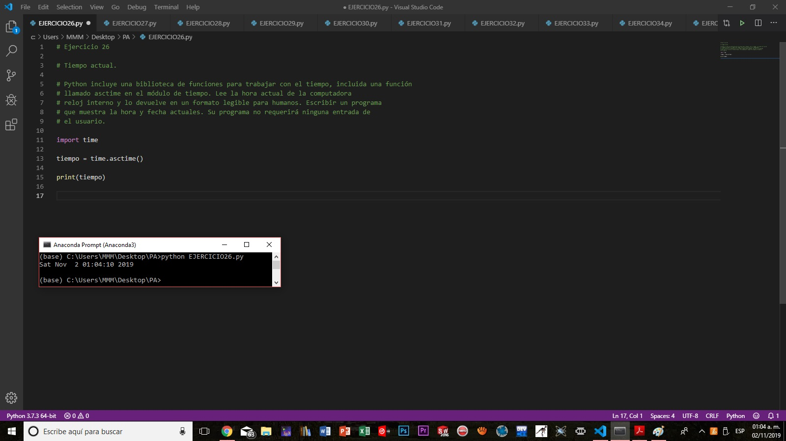

##### Click para ver el código: https://github.com/CHRISTIANCMARCOS/progAvanzada/blob/master/EJERCICIO26.py

### Ejercicio 27:  

####  

##### Click para ver el código:

### Ejercicio 28:  

####  

##### Click para ver el código:

### Ejercicio 29: Celsius a Fahrenheit y Kelvin. 

#### Un programa que debe mostrar la temperatura equivalente en grados Fahrenheit y grados Kelvin. 

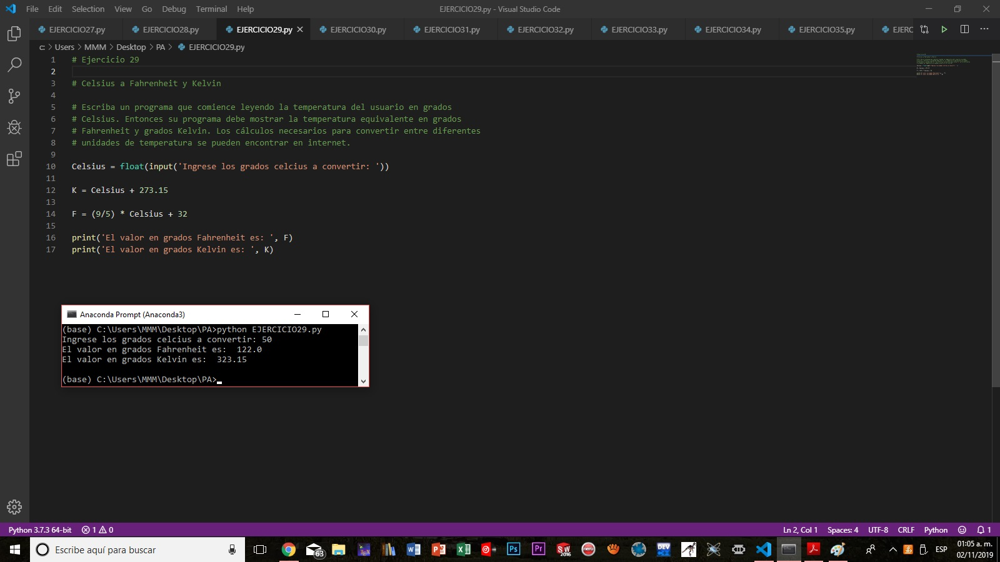

##### Click para ver el código: https://github.com/CHRISTIANCMARCOS/progAvanzada/blob/master/EJERCICIO29.py

### Ejercicio 30:  

####  

##### Click para ver el código:

### Ejercicio 31:  

####  

##### Click para ver el código:

### Ejercicio 32:  

####  

##### Click para ver el código:

### Ejercicio 33: Pan de un día.  

#### Un programa que debe mostrar el regular precio del pan, el descuento porque tiene un día y el precio total. 

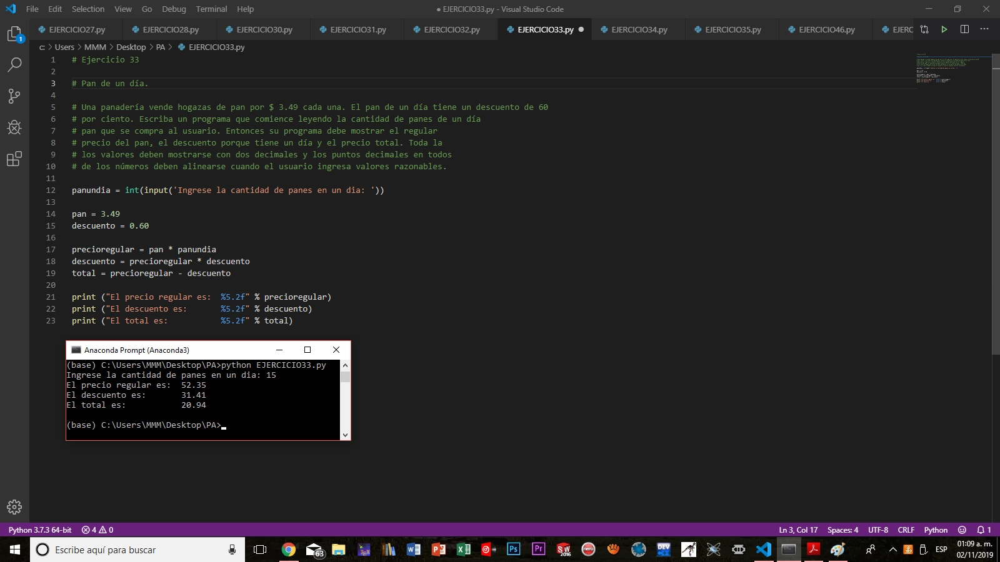

##### Click para ver el código: https://github.com/CHRISTIANCMARCOS/progAvanzada/blob/master/EJERCICIO33.py
# _________________________________________________________________
##               Ejercicios de declaracion if 
# _________________________________________________________________

#### Las construcciones de programación que usaste para resolver los ejercicios en el anterior. El capítulo seguirá siendo útil a medida que aborde estos problemas. Además, los ejercicios de este capítulo requerirán que utilice construcciones de toma de decisiones para que sus programas pueden manejar una variedad de situaciones diferentes que puedan surgir.

### Ejercicio 34: ¿Par o impar?.  

#### Un programa que lee un numero entero introducido por el usuario. Evalua si es par o impar. 

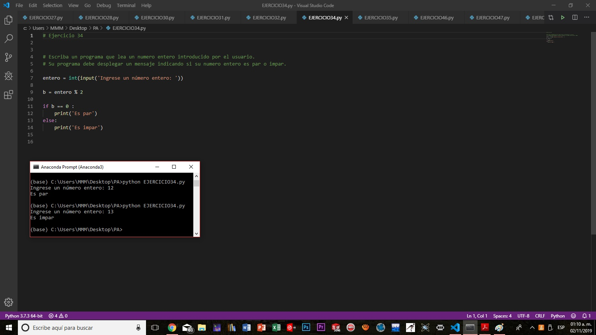

##### Click para ver el código: https://github.com/CHRISTIANCMARCOS/progAvanzada/blob/master/EJERCICIO34.py

### Ejercicio 35: Años de perro. 

#### Un programa que implemente la conversión de años humanos a años de perros.  

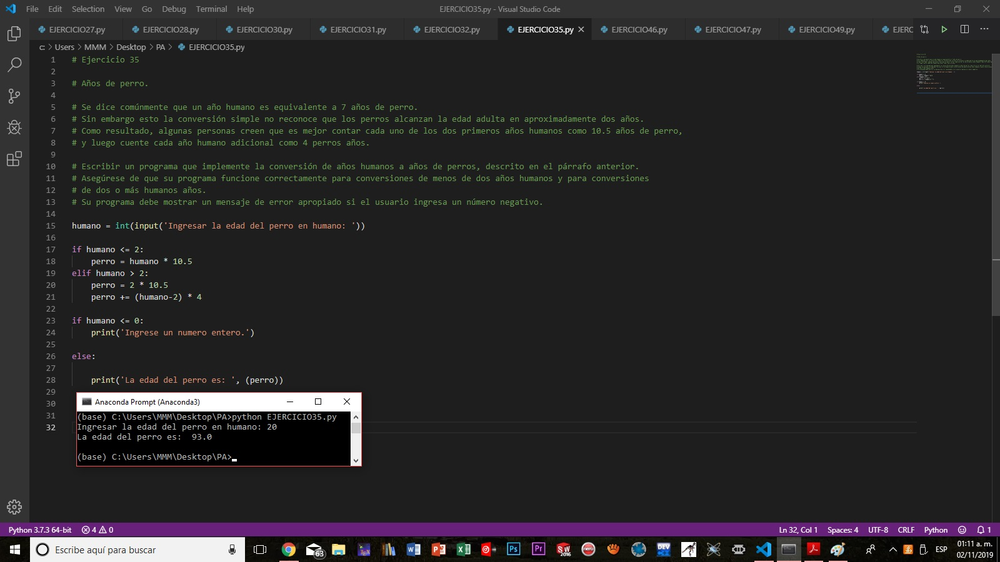

##### Click para ver el código: https://github.com/CHRISTIANCMARCOS/progAvanzada/blob/master/EJERCICIO35.py

### Ejercicio 36:   

####  

##### Click para ver el código:

### Ejercicio 37:  

####  

##### Click para ver el código:

### Ejercicio 38:  

####  

##### Click para ver el código:

### Ejercicio 39:  

####  

##### Click para ver el código:

### Ejercicio 40:  

####  

##### Click para ver el código:

### Ejercicio 41:  

####  

##### Click para ver el código:

### Ejercicio 42:  

####  

##### Click para ver el código:

### Ejercicio 43:  

####  

##### Click para ver el código:

### Ejercicio 44: Fecha de nombre de vacaciones.  

#### Un programa que leE un mes y un día del usuario. Si el mes y el dia coincidir con uno de los días festivos enumerados, entonces su programa debería mostrar nombre de vacaciones De lo contrario, su programa debe indicar que el mes ingresado y día no corresponde a un día festivo de fecha fija. 

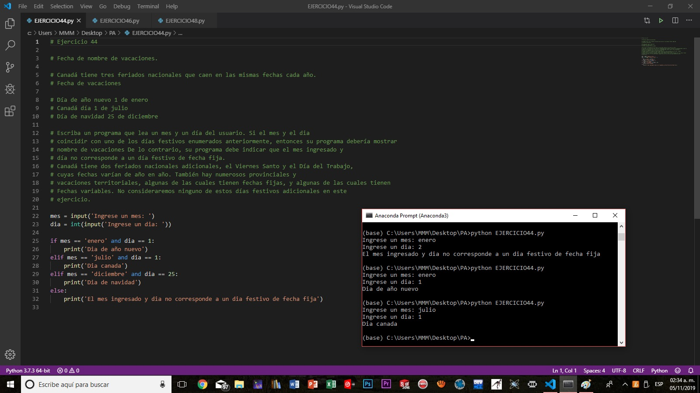

##### Click para ver el código: https://github.com/CHRISTIANCMARCOS/progAvanzada/blob/master/EJERCICIO44.py

### Ejercicio 45: ¿De qué color es ese cuadrado?.  

#### Un programa que leE una posición del usuario. Use una declaración if para determinar si la columna comienza con un cuadrado negro o un cuadrado blanco. Luego use modular aritmética para informar el color del cuadrado en esa fila. Por ejemplo, si el usuario ingresa a1 entonces su programa debe informar que el cuadrado es negro. Si el usuario ingresa d5 entonces su programa debe informar que el cuadrado es blanco. Su programa puede asumir que siempre se ingresará una posición válida. No necesita realizar ningún error comprobación. 

##### Click para ver el código: https://github.com/CHRISTIANCMARCOS/progAvanzada/blob/master/EJERCICIO45.py

### Ejercicio 46:  

####  

##### Click para ver el código:

### Ejercicio 47: Fecha de nacimiento astrologica.  

#### Un programa que pide al usuario que ingrese su mes y día de nacimiento. Entonces el programa debe informar el signo del zodiaco del usuario como parte de una salida adecuada mensaje. 

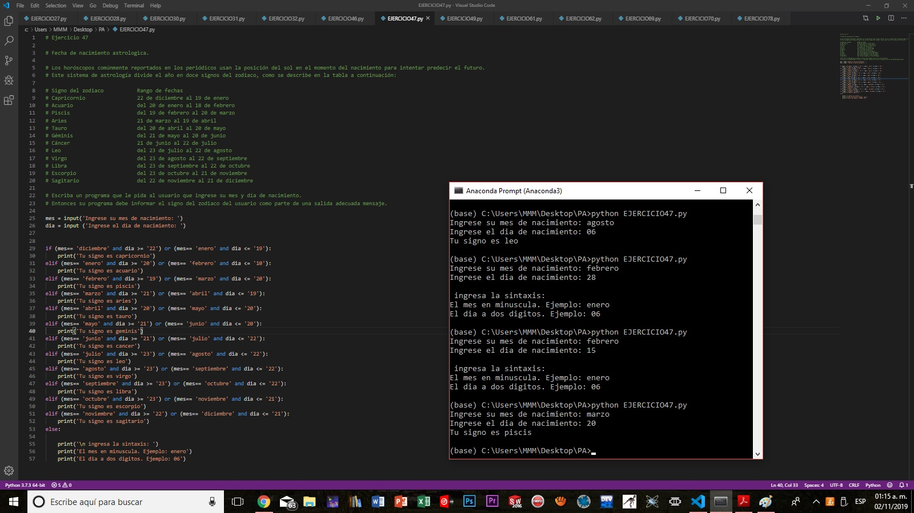

##### Click para ver el código: https://github.com/CHRISTIANCMARCOS/progAvanzada/blob/master/EJERCICIO47.py

### Ejercicio 48:  

####  

##### Click para ver el código:

### Ejercicio 49: Escala de richter.   

#### un programa que lea la admiración del usuario y muestre la información apropiada descriptor como parte de un mensaje significativo. Por ejemplo, si el usuario ingresa 5.5 entonces su programa debe indicar que un terremoto de magnitud 5.5 se considera terremoto moderado. 

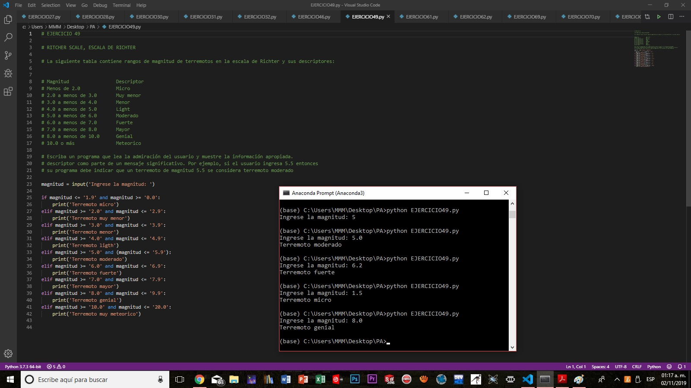

##### Click para ver el código: https://github.com/CHRISTIANCMARCOS/progAvanzada/blob/master/EJERCICIO49.py

### Ejercicio 50:  

####  

##### Click para ver el código:

### Ejercicio 51:  

####  

##### Click para ver el código:

### Ejercicio 52:  

####  

##### Click para ver el código:

### Ejercicio 53:  

####  

##### Click para ver el código:

### Ejercicio 54:  

####  

##### Click para ver el código:

### Ejercicio 55:  

####  

##### Click para ver el código:

### Ejercicio 56:  

####  

##### Click para ver el código:

### Ejercicio 57:  

####  

##### Click para ver el código:

### Ejercicio 58:  

####  

##### Click para ver el código:

### Ejercicio 59:  

####  

##### Click para ver el código:

### Ejercicio 60:  

####  

##### Click para ver el código:

# _____________________________________________________________________________________________________________________________________ 

##               Ejercicios de ciclo
# _____________________________________________________________________________________________________________________________________

### Ejercicio 61: Promedio. 

#### Un programa que calcula el promedio de una coleccion de valores insertados por el usuario, si el usuario introduce el valor 0 el programa debe dejar de pedir valores y posteriormente mostrar el promedio calculado. 

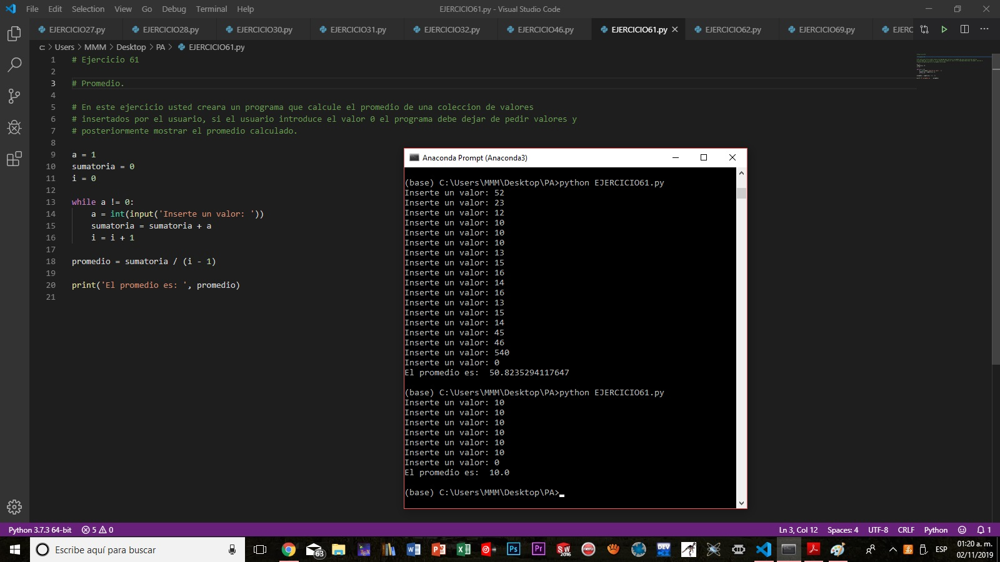

##### Click para ver el código: https://github.com/CHRISTIANCMARCOS/progAvanzada/blob/master/EJERCICIO61.py

### Ejercicio 62: Tabla de descuento.  

#### Un programa que usa un ciclo while para generar una tabla mostrando el precio original, el descuento y el nuevo precio para los productos de $4.95, $9,95, $14.95, $24.95. Los descuentos y los nuevos precios deben de ser redondeados a dos decimales. 

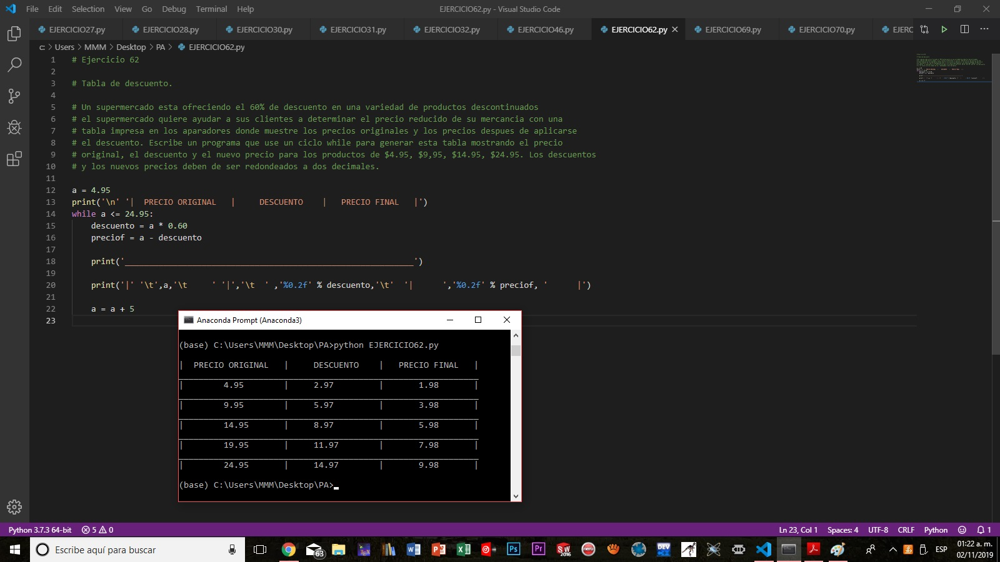

##### Click para ver el código: https://github.com/CHRISTIANCMARCOS/progAvanzada/blob/master/EJERCICIO62.py

### Ejercicio 63:  

####  

##### Click para ver el código:

### Ejercicio 64:  

####  

##### Click para ver el código:

### Ejercicio 65:  

####  

##### Click para ver el código:

### Ejercicio 66:  

####  

##### Click para ver el código:

### Ejercicio 67:  

####  

##### Click para ver el código:

### Ejercicio 68:  

####  

##### Click para ver el código:

### Ejercicio 69: π aproximado.  

#### Un programa que muestra 15 aproximaciones de π. La primera aproximación debe utilizar solo el primer término de la serie infinita. Cada aproximación adicional mostrado por el programa incluye un término más en la serie, haciendo una mejor aproximación de π que cualquiera de las aproximaciones mostradas anteriormente.  

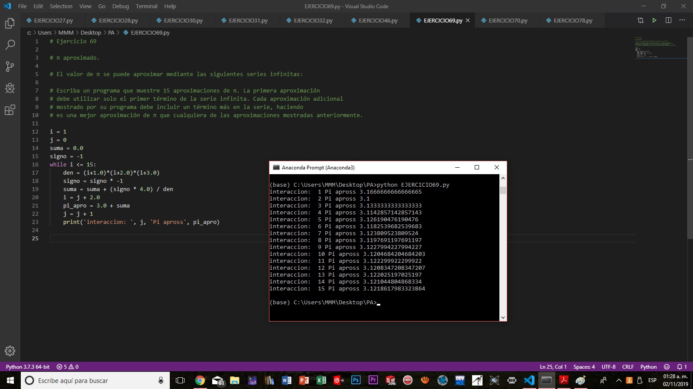

##### Click para ver el código: https://github.com/CHRISTIANCMARCOS/progAvanzada/blob/master/EJERCICIO69.py

### Ejercicio 70:  

####  

##### Click para ver el código:
