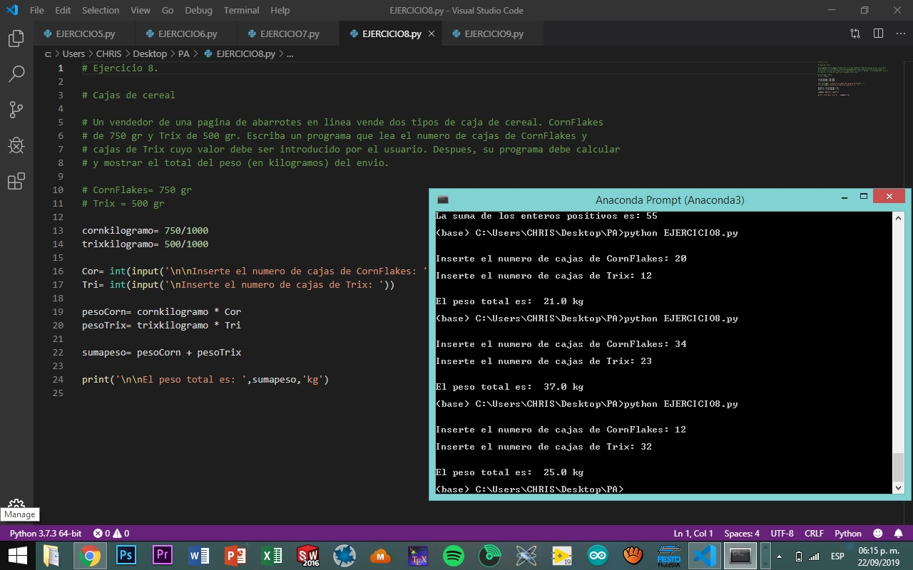

# Programación Avanzada 

## Introducción

### ¿Qué es Phyton?

Python es un lenguaje creado por Guido Van  Rossum a Principios de los años 1990. El lenguaje como tal responde a que tiene una sintais muy simple de usar el cual lo facilta para  principiantes . Se trata de un lenguaje de tipado o de script con tipado dinamico, multiplataforma y orientado a objetos.

Es un ejemplo de lenguaje de alto nive y guarda sus scripts con terminacion de archivo .py.

### ¿Qué es un lenguaje tipado o de script?

Aque que se ejecuta utilizando un programa intermedio , llamado interprete en lugrar de compilar el código o lenguaje  máquina que pueda comprender o ejecutar directamente una computadora.

### ¿Qué es el tipado dinámico?

No es necesario declarar el tipo de dato que va a contener una determinada variable , sino que su tipo se determinara en tiempo de ejecucion segun el tipo de valor al que se asigne y el tipo de esta variable puede cambiar si se le asigna el valor de otro tipo.

### ¿Qué es el fuertemente tipado?

No se permite tratar a una variable como si fuera de un tipo distinto al que se tiene, es necesario convertir de forma explicita dicha variable al nuevo tipo previamente.

### Multiplataforma

El interprete de Phython esta disponible en multitud de plataformas (Unix, Solaris, Linu, DOS, Windows, Mac OS, Android, IOS).Por lo que si no utilizamos librerias especificas de cada plataforma, nuestro programa podra correr en todos estos sistemas sin grandes cambios.

### ¿Qué significa orientado a objetos?

Es un paradigma de programación en el que los conceptos del mundo real relevantes para nuestro problema se trasladan a clases y objetos de nuestro programa.

### ¿Por qué Phyton?

Es un lenguaje que con su sintaxis simple, clara y sencilla, puede automatizar simples tareas como: mover y renombrar miles de archivos y clasificarlos en folders, llenar de forma automatica formularios en internet, descargar archivos o extraer información de páginas de internet de forma masiva, hacer que su computadora le envié información a su teléfono de quien la esta usando, checar su email y contestarlo de forma automática.

## Comandos

### print()

Imprime un mensaje en la pantalla o en otro dispositivo de salida. El mensaje puede ser una cadena de caracteres o cualquier objeto que sea convertible a cadena de caracteres

#### Ejemplo:

print('Hola')

### input()

Permite al usuario introducir información utiliando el teclado, la variable donde se guarda dicha info es del tipo string o cadena de caracteres.

input('Inserta tu edad: ')

### int

Convierte cualquier dato al tipo entero 

### float 

Convierte cualquier dato al tipo decimal 

## Programas

### Ejercicio 1: Dirección de envió.

#### Un programa que muestra un remitente y un destinatario, a fin de que se visualize para imprimir en un sobre de correo.

 

##### Click para ver el código: https://github.com/CHRISTIANCMARCOS/progAvanzada/blob/master/EJERCICIO1.py  

### Ejercicio 2: Hola.

#### Un programa que le pide al usuario su nombre y le contesta hola.

##### Click para ver el código: https://github.com/CHRISTIANCMARCOS/progAvanzada/blob/master/EJERCICIO2.py  

### Ejercicio 3: Área de una habitación.

#### Un programa que calcula el área, introduciendo el largo y el ancho en metros.

##### Click para ver el código: https://github.com/CHRISTIANCMARCOS/progAvanzada/blob/master/EJERCICIO3.py

### Ejercicio 4: Área de un campo.

#### Un programa que calcula el área de un campo y lo despliega en acres.

##### Click para ver el código: https://github.com/CHRISTIANCMARCOS/progAvanzada/blob/master/EJERCICIO4.py

### Ejercicio 5: Depositos de botellas.

#### Un programa que calcula el total de dolares de las botellas introducidas, ya sean chicas o grandes.

##### Click para ver el código: https://github.com/CHRISTIANCMARCOS/progAvanzada/blob/master/EJERCICIO5.py

### Ejercicio 6: Impuestos y propina.

#### Un programa que el ususario introduce sus alimentos y el precio, obteniendo el porcentaje de impuestos y propina del total de la cuenta.

##### Click para ver el código: https://github.com/CHRISTIANCMARCOS/progAvanzada/blob/master/EJERCICIO6.py

### Ejercicio 7: Suma de los primeros numeros n enteros positivos.

#### Un programa que calcula la suma de los numeros enteros positivos de un numero.

##### Click para ver el código: https://github.com/CHRISTIANCMARCOS/progAvanzada/blob/master/EJERCICIO7.py

### Ejercicio 8: Cajas de cereal.

#### Un programa que calcula el peso de las cajas de cereal introducidas por el ususario.

##### Click para ver el código: https://github.com/CHRISTIANCMARCOS/progAvanzada/blob/master/EJERCICIO8.py

### Ejercicio 9: Interés compuesto.

#### Un programa que calcula el interes del estado de cuenta para tres años de un usuario.

##### Click para ver el código: https://github.com/CHRISTIANCMARCOS/progAvanzada/blob/master/EJERCICIO9.py

### Ejercicio 10: Aritmética.

#### Un programa que calcula operaciones básicas con dos variables.

##### Click para ver el código: https://github.com/CHRISTIANCMARCOS/progAvanzada/blob/master/EJERCICIO10.py

### Ejercicio 11: Eficiencia de combustible.

#### Un convertidor de eficiencia de EUA (MPG) a unidades Mexicanas (L/100km).

##### Click para ver el código: https://github.com/CHRISTIANCMARCOS/progAvanzada/blob/master/EJERCICIO11.py

