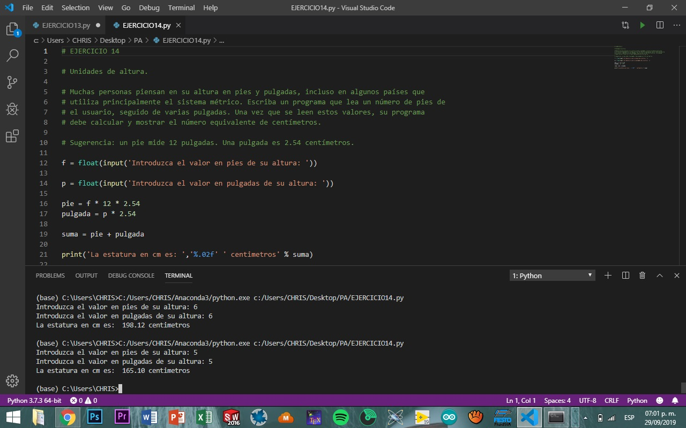
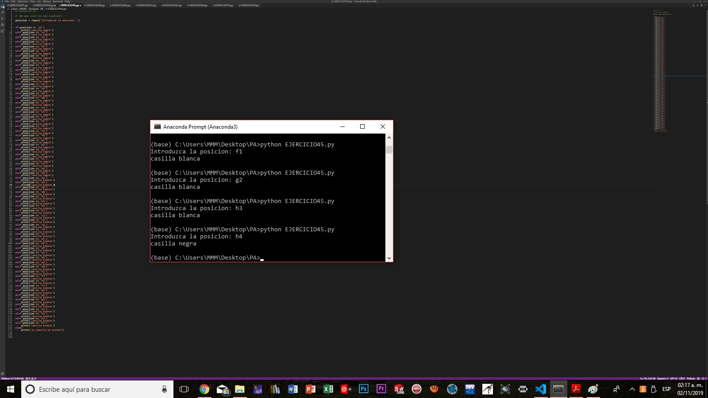
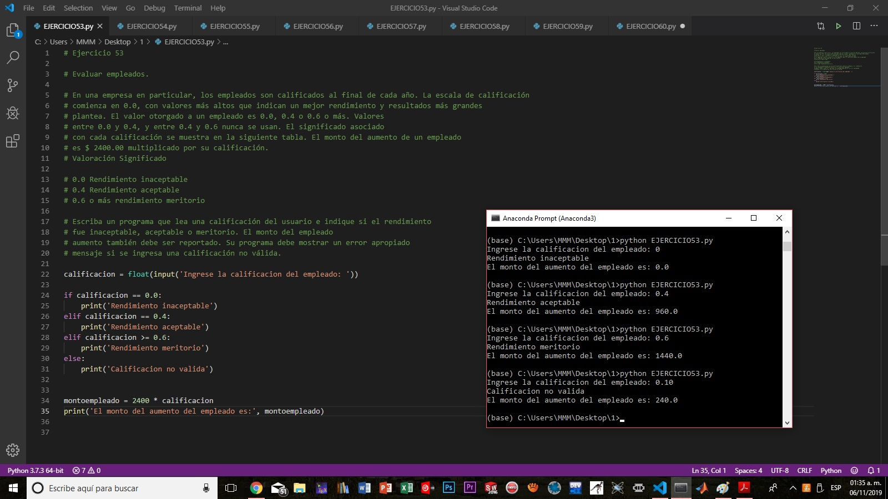
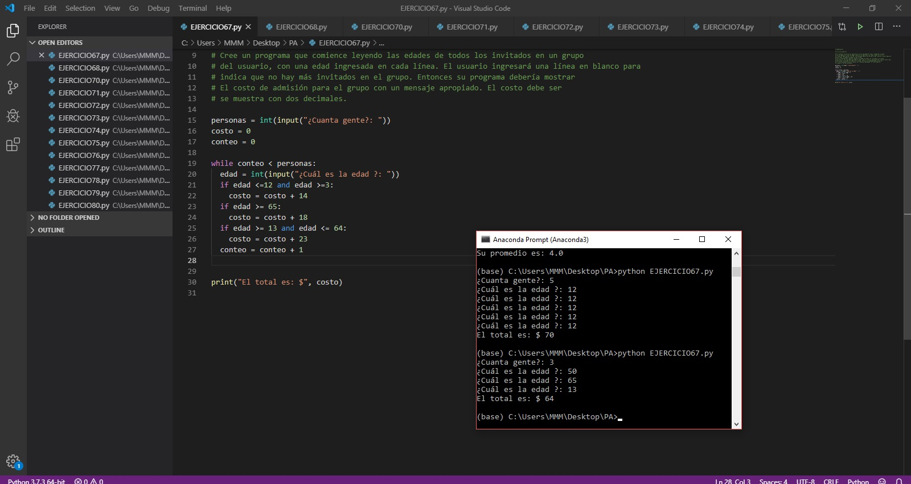
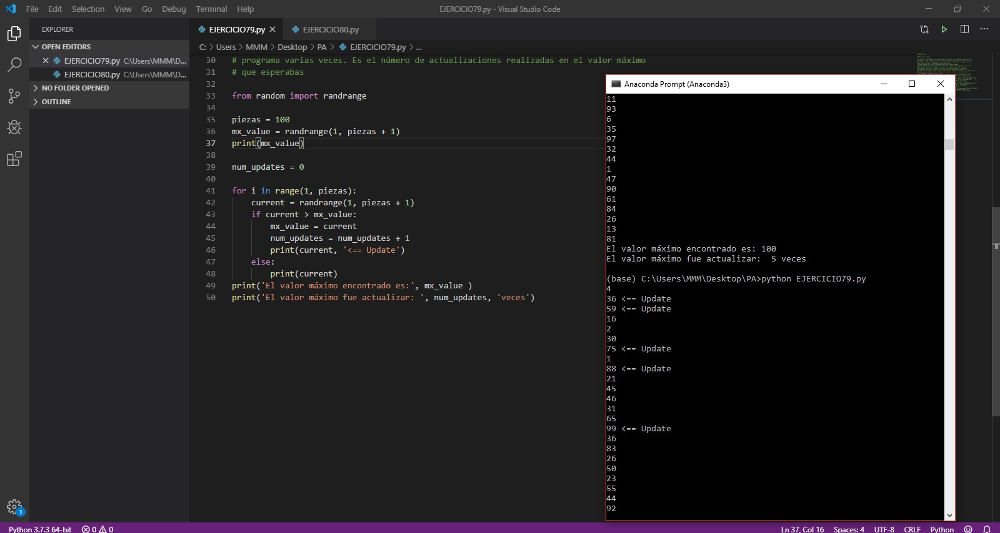

#                   Programación Avanzada 

## Introducción

### ¿Qué es Phyton?

Python es un lenguaje creado por Guido Van  Rossum a Principios de los años 1990. El lenguaje como tal responde a que tiene una sintais muy simple de usar el cual lo facilta para  principiantes . Se trata de un lenguaje de tipado o de script con tipado dinamico, multiplataforma y orientado a objetos.

Es un ejemplo de lenguaje de alto nive y guarda sus scripts con terminacion de archivo .py.

### ¿Qué es un lenguaje tipado o de script?

Aque que se ejecuta utilizando un programa intermedio , llamado interprete en lugrar de compilar el código o lenguaje  máquina que pueda comprender o ejecutar directamente una computadora.

### ¿Qué es el tipado dinámico?

No es necesario declarar el tipo de dato que va a contener una determinada variable , sino que su tipo se determinara en tiempo de ejecucion segun el tipo de valor al que se asigne y el tipo de esta variable puede cambiar si se le asigna el valor de otro tipo.

### ¿Qué es el fuertemente tipado?

No se permite tratar a una variable como si fuera de un tipo distinto al que se tiene, es necesario convertir de forma explicita dicha variable al nuevo tipo previamente.

### Multiplataforma

El interprete de Phython esta disponible en multitud de plataformas (Unix, Solaris, Linu, DOS, Windows, Mac OS, Android, IOS).Por lo que si no utilizamos librerias especificas de cada plataforma, nuestro programa podra correr en todos estos sistemas sin grandes cambios.

### ¿Qué significa orientado a objetos?

Es un paradigma de programación en el que los conceptos del mundo real relevantes para nuestro problema se trasladan a clases y objetos de nuestro programa.

### ¿Por qué Phyton?

Es un lenguaje que con su sintaxis simple, clara y sencilla, puede automatizar simples tareas como: mover y renombrar miles de archivos y clasificarlos en folders, llenar de forma automatica formularios en internet, descargar archivos o extraer información de páginas de internet de forma masiva, hacer que su computadora le envié información a su teléfono de quien la esta usando, checar su email y contestarlo de forma automática.

## Comandos

### print()

Imprime un mensaje en la pantalla o en otro dispositivo de salida. El mensaje puede ser una cadena de caracteres o cualquier objeto que sea convertible a cadena de caracteres

#### Ejemplo:

print('Hola')

### input()

Permite al usuario introducir información utiliando el teclado, la variable donde se guarda dicha info es del tipo string o cadena de caracteres.

input('Inserta tu edad: ')

### int

Convierte cualquier dato al tipo entero 

### float 

Convierte cualquier dato al tipo decimal 

# Programas ...............................................
### Ejercicio 0: BICIFLOR.

#### Un programa que muestra un remitente y un destinatario, a fin de que se visualize para imprimir en un sobre de correo.

 

##### Click para ver el código: https://github.com/CHRISTIANCMARCOS/progAvanzada/blob/master/BICIFLOR.py

### Ejercicio 1: Dirección de envió.

#### Un programa que muestra un remitente y un destinatario, a fin de que se visualize para imprimir en un sobre de correo.

 

##### Click para ver el código: https://github.com/CHRISTIANCMARCOS/progAvanzada/blob/master/EJERCICIO1.py  

### Ejercicio 2: Hola.

#### Un programa que le pide al usuario su nombre y le contesta hola.

##### Click para ver el código: https://github.com/CHRISTIANCMARCOS/progAvanzada/blob/master/EJERCICIO2.py  

### Ejercicio 3: Área de una habitación.

#### Un programa que calcula el área, introduciendo el largo y el ancho en metros.

##### Click para ver el código: https://github.com/CHRISTIANCMARCOS/progAvanzada/blob/master/EJERCICIO3.py

### Ejercicio 4: Área de un campo.

#### Un programa que calcula el área de un campo y lo despliega en acres.

##### Click para ver el código: https://github.com/CHRISTIANCMARCOS/progAvanzada/blob/master/EJERCICIO4.py

### Ejercicio 5: Depositos de botellas.

#### Un programa que calcula el total de dolares de las botellas introducidas, ya sean chicas o grandes.

##### Click para ver el código: https://github.com/CHRISTIANCMARCOS/progAvanzada/blob/master/EJERCICIO5.py

### Ejercicio 6: Impuestos y propina.

#### Un programa que el ususario introduce sus alimentos y el precio, obteniendo el porcentaje de impuestos y propina del total de la cuenta.

##### Click para ver el código: https://github.com/CHRISTIANCMARCOS/progAvanzada/blob/master/EJERCICIO6.py

### Ejercicio 7: Suma de los primeros numeros n enteros positivos.

#### Un programa que calcula la suma de los numeros enteros positivos de un numero.

##### Click para ver el código: https://github.com/CHRISTIANCMARCOS/progAvanzada/blob/master/EJERCICIO7.py

### Ejercicio 8: Cajas de cereal.

#### Un programa que calcula el peso de las cajas de cereal introducidas por el ususario.

##### Click para ver el código: https://github.com/CHRISTIANCMARCOS/progAvanzada/blob/master/EJERCICIO8.py

### Ejercicio 9: Interés compuesto.

#### Un programa que calcula el interes del estado de cuenta para tres años de un usuario.

##### Click para ver el código: https://github.com/CHRISTIANCMARCOS/progAvanzada/blob/master/EJERCICIO9.py

### Ejercicio 10: Aritmética.

#### Un programa que calcula operaciones básicas con dos variables.

##### Click para ver el código: https://github.com/CHRISTIANCMARCOS/progAvanzada/blob/master/EJERCICIO10.py

### Ejercicio 11: Eficiencia de combustible.

#### Un convertidor de eficiencia de EUA (MPG) a unidades Mexicanas (L/100km).

##### Click para ver el código: https://github.com/CHRISTIANCMARCOS/progAvanzada/blob/master/EJERCICIO11.py

### Ejercicio 12: Distancia entre dos puntos en la Tierra. 

#### La distancia entre dos puntos de la tierra ingresando los valores en grados. 

##### Click para ver el código: https://github.com/CHRISTIANCMARCOS/progAvanzada/blob/master/EJERCICIO12.py

### Ejercicio 13: Haciendo el cambio. 

#### Un programa que lee, la cantidad de centavos como entero y calcula las denominaciones de monedas que deberían usarse para dar esa cantidad de cambio. El cambio debe administrarse utilizando la menor cantidad de monedas posible.  

##### Click para ver el código: https://github.com/CHRISTIANCMARCOS/progAvanzada/blob/master/EJERCICIO13.py

### Ejercicio 14: Unidades de altura. 

#### Un programa que lee un número de pies, seguido de varias pulgadas. Una vez que se lee estos valores, su programa debe calcular y mostrar el número equivalente de centímetros.

##### Click para ver el código: https://github.com/CHRISTIANCMARCOS/progAvanzada/blob/master/EJERCICIO14.py

### Ejercicio 15: Unidades de distancia. 

#### Un programa que comienza leyendo una medida en pies. Entonces el programa debe mostrar la distancia equivalente en pulgadas, yardas y millas.

##### Click para ver el código: https://github.com/CHRISTIANCMARCOS/progAvanzada/blob/master/EJERCICIO15.py

### Ejercicio 16: Área y Volumen. 

#### Un programa que lee un radio. El programa calcula y muestra el área de un círculo con radio r y el volumen de una esfera.

##### Click para ver el código: https://github.com/CHRISTIANCMARCOS/progAvanzada/blob/master/EJERCICIO16.py

### Ejercicio 17: Capacidad calorífica. 

#### Un programa que lee la masa de un poco de agua y el cambio de temperatura. El programa debe mostrar la cantidad total de energía que debe ser agregado o eliminado para lograr el cambio de temperatura deseado, también calcula el costo de calentar el agua. 

##### Click para ver el código: https://github.com/CHRISTIANCMARCOS/progAvanzada/blob/master/EJERCICIO17.py

### Ejercicio 18: Volumen de un cilindro. 

#### Un programa que lee el radio del cilindro, junto con su altura  y calcula su volumen.

##### Click para ver el código: https://github.com/CHRISTIANCMARCOS/progAvanzada/blob/master/EJERCICIO18.py

### Ejercicio 19: Caida libre. 

#### Un programa que calcula la velocidad final de un objeto con referente a una altura.  

##### Click para ver el código: https://github.com/CHRISTIANCMARCOS/progAvanzada/blob/master/EJERCICIO19.py

### Ejercicio 20: Ley del gas ideal. 

#### Un programa que calcula la cantidad de gas en moles cuando el usuario suministra la presión, el volumen y la temperatura.  

##### Click para ver el código: https://github.com/CHRISTIANCMARCOS/progAvanzada/blob/master/EJERCICIO20.py

### Ejercicio 21: Área de un triángulo.  

#### Un programa que permite al usuario ingresar valores para b y h. El programa luego debe calcular y mostrar el área de un triángulo con longitud base b y altura h.  

##### Click para ver el código: https://github.com/CHRISTIANCMARCOS/progAvanzada/blob/master/EJERCICIO21.py

### Ejercicio 22: Área de un triángulo (de nuevo). 

#### El área del triángulo se puede calcular usando una fórmula.

##### Click para ver el código: https://github.com/CHRISTIANCMARCOS/progAvanzada/blob/master/EJERCICIO22.py

### Ejercicio 23: Área de un polígono regular.  

#### El área de un polígono regular se puede calcular usando una fórmula, donde s es la longitud de un lado y n es el número de lados. 

##### Click para ver el código: https://github.com/CHRISTIANCMARCOS/progAvanzada/blob/master/EJERCICIO23.py

### Ejercicio 24: Unidades de tiempo.  

#### Un programa que pide la duración de días, horas, minutos y segundos que calcula y desplega la cantidad total de segundos de duración.  
 

##### Click para ver el código: https://github.com/CHRISTIANCMARCOS/progAvanzada/blob/master/EJERCICIO24.py

### Ejercicio 25: Unidades de tiempo 2.   

#### Un programa que comienza por leer una cantidad de segundos introducidos. El programa debe despliega la cantidad equivalente en la forma de DD:HH:MM:SS, donde DD son los dias, HH son las horas, MM son los minutos y SS son los segundos.  

##### Click para ver el código: https://github.com/CHRISTIANCMARCOS/progAvanzada/blob/master/EJERCICIO25.py

### Ejercicio 26: Tiempo actual. 

#### Un programa que muestra la hora y fecha actuales. El programa no requiere ninguna entrada de el usuario.  

##### Click para ver el código: https://github.com/CHRISTIANCMARCOS/progAvanzada/blob/master/EJERCICIO26.py

### Ejercicio 27: Índice de masa corporal  

#### Un programa que calcula el índice de masa corporal (IMC) de un individuo. El programa debe comenzar leyendo una altura y un peso del usuario.  

##### Click para ver el código: https://github.com/CHRISTIANCMARCOS/progAvanzada/blob/master/EJERCICIO27.py

### Ejercicio 28: Escalofríos. 

#### Un programa que comience leyendo la temperatura del aire y la velocidad del viento del usuario. Una vez que se hayan leído estos valores, el programa debe mostrar la sensación térmica índice redondeado al entero más cercano. 

##### Click para ver el código: https://github.com/CHRISTIANCMARCOS/progAvanzada/blob/master/EJERCICIO28.py

### Ejercicio 29: Celsius a Fahrenheit y Kelvin. 

#### Un programa que debe mostrar la temperatura equivalente en grados Fahrenheit y grados Kelvin. 

##### Click para ver el código: https://github.com/CHRISTIANCMARCOS/progAvanzada/blob/master/EJERCICIO29.py

### Ejercicio 30: Unidades de presión. 

#### Un programa que lee la presión del usuario en kilopascales. Una vez que se ha leído la presión, el programa informa el equivalente presión en libras por pulgada cuadrada, milímetros de mercurio y atmósferas. 

##### Click para ver el código: https://github.com/CHRISTIANCMARCOS/progAvanzada/blob/master/EJERCICIO30.py

### Ejercicio 31: Suma de los dígitos en un entero. 

#### Un programa que lee un número entero de cuatro dígitos del usuario y muestra la suma de los dígitos en el número. Por ejemplo, si el usuario ingresa 3141, entonces el programa debe mostrar 3 + 1 + 4 + 1 = 9. 

##### Click para ver el código: https://github.com/CHRISTIANCMARCOS/progAvanzada/blob/master/EJERCICIO31.py

### Ejercicio 32: Ordenar 3 enteros. 

#### Un programa que lee tres enteros del usuario y los muestre ordenados orden (de menor a mayor). Usa las funciones min y max para encontrar el más pequeño y valores más grandes. El valor medio se puede encontrar calculando la suma de los tres valores, y luego restando el valor mínimo y el valor máximo.  

##### Click para ver el código: https://github.com/CHRISTIANCMARCOS/progAvanzada/blob/master/EJERCICIO32.py

### Ejercicio 33: Pan de un día.  

#### Un programa que debe mostrar el regular precio del pan, el descuento porque tiene un día y el precio total. 

##### Click para ver el código: https://github.com/CHRISTIANCMARCOS/progAvanzada/blob/master/EJERCICIO33.py

### Ejercicio 34: ¿Par o impar?.  

#### Un programa que lee un numero entero introducido por el usuario. Evalua si es par o impar. 

##### Click para ver el código: https://github.com/CHRISTIANCMARCOS/progAvanzada/blob/master/EJERCICIO34.py

### Ejercicio 35: Años de perro. 

#### Un programa que implemente la conversión de años humanos a años de perros.  

##### Click para ver el código: https://github.com/CHRISTIANCMARCOS/progAvanzada/blob/master/EJERCICIO35.py

### Ejercicio 36: Vocal o Consonante.  

#### Un programa que lee una letra del alfabeto del usuario. Si el usuario ingresa a, e, i, o, u, entonces su programa debería mostrar un mensaje indicando que la letra ingresada es una vocal. Si el usuario ingresa y entonces su programa debería mostrar un mensaje que indique que a veces y es una vocal, y a veces y es una consonante. De lo contrario, su programa debería mostrar un mensaje que indica que la letra es una consonante. 

##### Click para ver el código: https://github.com/CHRISTIANCMARCOS/progAvanzada/blob/master/EJERCICIO36.py

### Ejercicio 37: Nombra esa forma.  

#### Un programa que determina el nombre de una forma a partir de su número de lados. 

##### Click para ver el código: https://github.com/CHRISTIANCMARCOS/progAvanzada/blob/master/EJERCICIO37.py

### Ejercicio 38: Nombre del mes a la cantidad de días.  

#### Un programa que lee el nombre de un mes del usuario como una cadena. Entonces el programa debe muestra la cantidad de días en ese mes. 

##### Click para ver el código: https://github.com/CHRISTIANCMARCOS/progAvanzada/blob/master/EJERCICIO38.py

### Ejercicio 39: Niveles de sonido.  

#### Un programa que lee un nivel de sonido en decibelios del usuario.  

##### Click para ver el código: https://github.com/CHRISTIANCMARCOS/progAvanzada/blob/master/EJERCICIO39.py

### Ejercicio 40: Nombra ese triángulo.  

#### Un programa que lee las longitudes de 3 lados de un triángulo del usuario y muestra un mensaje que indica el tipo de triángulo. 

##### Click para ver el código: https://github.com/CHRISTIANCMARCOS/progAvanzada/blob/master/EJERCICIO40.py

### Ejercicio 41: Nota a frecuencia. 

#### Un programa que lee el nombre de una nota del usuario y muestra la frecuencia de la nota.  

##### Click para ver el código: https://github.com/CHRISTIANCMARCOS/progAvanzada/blob/master/EJERCICIO41.py

### Ejercicio 42: Frecuencia a tener en cuenta. 

#### Un programa que comienza leyendo una frecuencia del usuario, si la frecuencia está dentro de un Hertz de un valor listado el programa lo reconoce. 

##### Click para ver el código: https://github.com/CHRISTIANCMARCOS/progAvanzada/blob/master/EJERCICIO42.py

### Ejercicio 43: Caras sobre el dinero.  

#### Un programa que lee la denominación de un billete del usuario. Luego, el programa debe muestra el nombre de la persona que aparece en el billete de la cantidad ingresada. Se debe mostrar un mensaje de error apropiado si no existe tal nota. 

##### Click para ver el código: https://github.com/CHRISTIANCMARCOS/progAvanzada/blob/master/EJERCICIO43.py

### Ejercicio 44: Fecha de nombre de vacaciones.  

#### Un programa que lee un mes y un día del usuario. Si el mes y el dia coincidir con uno de los días festivos enumerados, entonces su programa debería mostrar nombre de vacaciones De lo contrario, su programa debe indicar que el mes ingresado y día no corresponde a un día festivo de fecha fija. 

##### Click para ver el código: https://github.com/CHRISTIANCMARCOS/progAvanzada/blob/master/EJERCICIO44.py

### Ejercicio 45: ¿De qué color es ese cuadrado?.  

#### Un programa que leE una posición del usuario. Use una declaración if para determinar si la columna comienza con un cuadrado negro o un cuadrado blanco. Luego use modular aritmética para informar el color del cuadrado en esa fila. Por ejemplo, si el usuario ingresa a1 entonces su programa debe informar que el cuadrado es negro. Si el usuario ingresa d5 entonces su programa debe informar que el cuadrado es blanco. Su programa puede asumir que siempre se ingresará una posición válida. No necesita realizar ningún error comprobación. 

##### Click para ver el código: https://github.com/CHRISTIANCMARCOS/progAvanzada/blob/master/EJERCICIO45.py

### Ejercicio 46: Temporada de mes y día. 

#### Un programa en el que el usuario introduce el mes y el dia. El programa debe despliega la temporada de acuerdo ala informacion introducida. 

##### Click para ver el código: https://github.com/CHRISTIANCMARCOS/progAvanzada/blob/master/EJERCICIO46.py

### Ejercicio 47: Fecha de nacimiento astrologica.  

#### Un programa que pide al usuario que ingrese su mes y día de nacimiento. Entonces el programa debe informar el signo del zodiaco del usuario como parte de una salida adecuada mensaje. 

##### Click para ver el código: https://github.com/CHRISTIANCMARCOS/progAvanzada/blob/master/EJERCICIO47.py

### Ejercicio 48: Zodiaco chino.  

#### Un programa que lee un año del usuario y muestra el animal asociado con ese año.  

##### Click para ver el código: https://github.com/CHRISTIANCMARCOS/progAvanzada/blob/master/EJERCICIO48.py

### Ejercicio 49: Escala de richter.   

#### un programa que lea la admiración del usuario y muestre la información apropiada descriptor como parte de un mensaje significativo. Por ejemplo, si el usuario ingresa 5.5 entonces su programa debe indicar que un terremoto de magnitud 5.5 se considera terremoto moderado. 

##### Click para ver el código: https://github.com/CHRISTIANCMARCOS/progAvanzada/blob/master/EJERCICIO49.py

### Ejercicio 50: Raíces de una función cuadrática.  

#### Un programa que calcula las raíces reales de una función cuadrática.   

##### Click para ver el código: https://github.com/CHRISTIANCMARCOS/progAvanzada/blob/master/EJERCICIO50.py

### Ejercicio 51: Calificación de letras a puntos de calificación.  

#### Un programa que comienza leyendo una calificación de letra del usuario.El programa calcula y muestra el número equivalente de puntos de calificación. 

##### Click para ver el código: https://github.com/CHRISTIANCMARCOS/progAvanzada/blob/master/EJERCICIO51.py

### Ejercicio 52: Calificación de puntos a calificación de letras.  

#### Programa que invierte el proceso y convierte de un valor de punto de calificación introducido por el usuario a un grado de la letra.  

##### Click para ver el código: https://github.com/CHRISTIANCMARCOS/progAvanzada/blob/master/EJERCICIO52.py

### Ejercicio 53: Evaluar empleados.   

#### Programa que lee una calificación del usuario e indica si el rendimiento fue inaceptable, aceptable o meritorio. 

##### Click para ver el código: https://github.com/CHRISTIANCMARCOS/progAvanzada/blob/master/EJERCICIO53.py

### Ejercicio 54: Longitudes de onda de luz visible.  

#### Programa que lee la longitud de onda del usuario e informa su color. Monitor un mensaje de error apropiado si la longitud de onda ingresada por el usuario está fuera de espectro visible.  

##### Click para ver el código: https://github.com/CHRISTIANCMARCOS/progAvanzada/blob/master/EJERCICIO54.py

### Ejercicio 55: Frecuencia para nombrar.  

#### Programa que lee la frecuencia de la radiación del usuario y muestra el nombre apropiado.  

##### Click para ver el código: https://github.com/CHRISTIANCMARCOS/progAvanzada/blob/master/EJERCICIO55.py

### Ejercicio 56: Bill de teléfono celular.  

#### Programa que lee la cantidad de minutos y mensajes de texto utilizados en un mes del usuario. Muestra el cargo base, el cargo por minutos adicionales (si corresponde), cargo adicional por mensaje de texto (si corresponde), la tarifa 911, impuestos y el monto total de la factura.  

##### Click para ver el código: https://github.com/CHRISTIANCMARCOS/progAvanzada/blob/master/EJERCICIO56.py

### Ejercicio 57: ¿Es un año bisiesto?.  

#### Programa que lea un año del usuario y muestre un mensaje que indique si es o no un año bisiesto.  

##### Click para ver el código: https://github.com/CHRISTIANCMARCOS/progAvanzada/blob/master/EJERCICIO57.py

### Ejercicio 58: Día siguiente.  

#### Programa que lee una fecha del usuario y calcula su sucesor inmediato. 

##### Click para ver el código: https://github.com/CHRISTIANCMARCOS/progAvanzada/blob/master/EJERCICIO58.py

### Ejercicio 59: ¿Es válida una matrícula?.  

#### Programa que muestra un mensaje que indique si los caracteres son válidos para una placa de estilo anterior o una placa de estilo más nueva. Su programa debe mostrar un mensaje apropiado si la cadena ingresada por el usuario no es válida para estilo de matrícula. 

##### Click para ver el código: https://github.com/CHRISTIANCMARCOS/progAvanzada/blob/master/EJERCICIO59.py

### Ejercicio 60: Pagos de ruleta.  

#### Programa que simula el giro de una rueda de ruleta utilizando el método aleatorio de Python generador de números, muestra el número seleccionado y todas las apuestas que deben ser pagados. 

##### Click para ver el código: https://github.com/CHRISTIANCMARCOS/progAvanzada/blob/master/EJERCICIO60.py

### Ejercicio 61: Promedio. 

#### Un programa que calcula el promedio de una coleccion de valores insertados por el usuario, si el usuario introduce el valor 0 el programa debe dejar de pedir valores y posteriormente mostrar el promedio calculado. 

##### Click para ver el código: https://github.com/CHRISTIANCMARCOS/progAvanzada/blob/master/EJERCICIO61.py

### Ejercicio 62: Tabla de descuento.  

#### Un programa que usa un ciclo while para generar una tabla mostrando el precio original, el descuento y el nuevo precio para los productos de $4.95, $9,95, $14.95, $24.95. Los descuentos y los nuevos precios deben de ser redondeados a dos decimales. 

##### Click para ver el código: https://github.com/CHRISTIANCMARCOS/progAvanzada/blob/master/EJERCICIO62.py

### Ejercicio 63: Tabla de conversión de temperatura.  

#### Programa que muestra una tabla de conversión de temperatura para grados Celsius y grados Fahrenheit.  

##### Click para ver el código: https://github.com/CHRISTIANCMARCOS/progAvanzada/blob/master/EJERCICIO63.py

### Ejercicio 64: No más centavos.  

#### Programa que lee los precios del usuario hasta que se ingrese una línea en blanco.Muestra el costo total de todos los artículos ingresados en una línea, seguido del monto debido si el cliente paga con efectivo en una segunda línea. El monto adeudado por un efectivo el pago debe redondearse al níquel más cercano. 

##### Click para ver el código: https://github.com/CHRISTIANCMARCOS/progAvanzada/blob/master/EJERCICIO64.py

### Ejercicio 65: Calcular el perímetro de un polígono.  

#### Programa que calcula el perímetro de un polígono. Comience leyendo la x, valores y para el primer punto en el perímetro del polígono del usuario.  

##### Click para ver el código: https://github.com/CHRISTIANCMARCOS/progAvanzada/blob/master/EJERCICIO65.py

### Ejercicio 66: Calcular un promedio de calificaciones.  

#### Programa que calcula el promedio de calificaciones de un número arbitrario de calificaciones de letras ingresadas por el usuario.

##### Click para ver el código: https://github.com/CHRISTIANCMARCOS/progAvanzada/blob/master/EJERCICIO66.py

### Ejercicio 67: Precio de admisión.  

#### Programa que comienza leyendo las edades de todos los invitados en un grupo del usuario, con una edad ingresada en cada línea. 

##### Click para ver el código: https://github.com/CHRISTIANCMARCOS/progAvanzada/blob/master/EJERCICIO67.py

### Ejercicio 68: Bits de paridad.  

#### Programa que calcula el bit de paridad para grupos de 8 bits ingresados, por usuario usando paridad par. Su programa debe leer cadenas que contengan 8 bits hasta que el usuario ingresa una línea en blanco.  

##### Click para ver el código: https://github.com/CHRISTIANCMARCOS/progAvanzada/blob/master/EJERCICIO68.py

### Ejercicio 69: π aproximado.  

#### Un programa que muestra 15 aproximaciones de π. La primera aproximación debe utilizar solo el primer término de la serie infinita. Cada aproximación adicional mostrado por el programa incluye un término más en la serie, haciendo una mejor aproximación de π que cualquiera de las aproximaciones mostradas anteriormente.  

##### Click para ver el código: https://github.com/CHRISTIANCMARCOS/progAvanzada/blob/master/EJERCICIO69.py

### Ejercicio 70: Cifrado César  

#### Programa que implementa el cifrado cesar. Permite que el usuario inserte el mensaje y la cantidad de espacios a moverse, y despues despliega el mensaje movido.  

##### Click para ver el código: https://github.com/CHRISTIANCMARCOS/progAvanzada/blob/master/EJERCICIO70.py

### Ejercicio 71: Raíz cuadrada.  

#### Programa que implemente el método de Newton para calcular y mostrar el cuadrado raíz de un número ingresado por el usuario. 

##### Click para ver el código:https://github.com/CHRISTIANCMARCOS/progAvanzada/blob/master/EJERCICIO71.py

### Ejercicio 72: ¿Es una cuerda un palíndromo?.   

#### Programa que lee una cadena del usuario y usa un bucle para determinar si es o no un palíndromo. 

##### Click para ver el código: https://github.com/CHRISTIANCMARCOS/progAvanzada/blob/master/EJERCICIO72.py

### Ejercicio 73: Palindromos de palabras múltiples.   

#### Un programa que extienda su solución para que también ignore los signos de puntuación y trate las mayúsculas y letras minúsculas como equivalentes. 

##### Click para ver el código: https://github.com/CHRISTIANCMARCOS/progAvanzada/blob/master/EJERCICIO73.py

### Ejercicio 74: Tabla de multiplicación.   

#### Programa que muestra una tabla de multiplicación que muestra los productos de todas las combinaciones de enteros desde 1 por 1 hasta 10 veces 10. 

##### Click para ver el código: https://github.com/CHRISTIANCMARCOS/progAvanzada/blob/master/EJERCICIO74.py

### Ejercicio 75: Máximo común divisor.   

#### Programa que lee dos enteros positivos del usuario y use este algoritmo para determinar e informar su mayor divisor común.  

##### Click para ver el código: https://github.com/CHRISTIANCMARCOS/progAvanzada/blob/master/EJERCICIO75.py

### Ejercicio 76: Factores primos.   

#### Programa que lea un número entero del usuario. Si el valor ingresado por el usuario tiene menos de 2, entonces su programa debería mostrar un mensaje de error apropiado.  

##### Click para ver el código: https://github.com/CHRISTIANCMARCOS/progAvanzada/blob/master/EJERCICIO76.py

### Ejercicio 77: Binario a decimal.   

#### Programa que convierte un número binario (base 2) a decimal (base 10). 

##### Click para ver el código: https://github.com/CHRISTIANCMARCOS/progAvanzada/blob/master/EJERCICIO77.py

### Ejercicio 78:    

#### Programa que convierte un numero decimal(base 10)que inserte un usuario como numero y despues use el lograritmo division mostrado para realizar la conversion.   

##### Click para ver el código: https://github.com/CHRISTIANCMARCOS/progAvanzada/blob/master/EJERCICIO78.py

### Ejercicio 79: Número entero máximo.   

#### Programa que actualiza el número máximo encontrado y cuente el hecho de que realizó una actualización. 

##### Click para ver el código: https://github.com/CHRISTIANCMARCOS/progAvanzada/blob/master/EJERCICIO79.py

### Ejercicio 80: Coin Flip Simulation.   

#### Programa que debe voltearse simulado monedas hasta que ocurran 3 caras consecutivas de 3 colas consecutivas. Mostrar una H cada vez que el resultado es cara y una T cada vez que el resultado es cruz, con todos los resultados mostrados en la misma línea.  

##### Click para ver el código: https://github.com/CHRISTIANCMARCOS/progAvanzada/blob/master/EJERCICIO80.py

### Ejercicio 81: Hipotenusa.    

#### Programa que escribe una funcion que tome la longitud de los dos lados mas cortos de un triangulo rectangulo como argumentos. 

##### Click para ver el código: https://github.com/CHRISTIANCMARCOS/progAvanzada/blob/master/EJERCICIO81.py

### Ejercicio 82: Tarifa.   

#### Programa que escriba una funcion que tome la distancia viajada (km) el cual debe ser el unico argumento y regrese la tarifa total como resultado y que demuestre la funcion.  

##### Click para ver el código: https://github.com/CHRISTIANCMARCOS/progAvanzada/blob/master/EJERCICIO82.py

### Ejercicio 83: Envio.   

#### Programa que escribe una funcion que tome el numero de productos como su unico argumento Regrese el costo de encio total como el resutado de la funcion, incluyaun programa principal que lea el numero de productos comprados por el ususario y que despliegue el costo total de envio. 

##### Click para ver el código: https://github.com/CHRISTIANCMARCOS/progAvanzada/blob/master/EJERCICIO83.py

### Ejercicio 84: Convertir un numero entero a numero cardinal.   

#### Programa principal que demuestra su funcion desplegando cada entero del 1 al 12 y su numero cardinal. 

##### Click para ver el código: https://github.com/CHRISTIANCMARCOS/progAvanzada/blob/master/EJERCICIO84.py

### Ejercicio 85: Mediana de tres valores.   

#### Escribe una función que tome tres números como parámetros y devuelva el valor medio de esos parámetros como resultado. Incluya un programa principal que lea tres valores de el usuario y muestra su mediana.  

##### Click para ver el código: https://github.com/CHRISTIANCMARCOS/progAvanzada/blob/master/EJERCICIO85.py

### Ejercicio 86: Los doce días de navidad.   

#### Programa que muestra la letra completa de Los doce Días de navidad.  

##### Click para ver el código: https://github.com/CHRISTIANCMARCOS/progAvanzada/blob/master/EJERCICIO86.py

### Ejercicio 87: Centrar una cadena en la terminal.   

#### Escribe una función que tome una cadena de caracteres como primer parámetro y el ancho de el terminal en caracteres como su segundo parámetro. Su función debería devolver un nuevo cadena que consta de la cadena original y el número correcto de espacios iniciales para que la cadena original aparezca centrada dentro del ancho proporcionado cuando está impreso.  

##### Click para ver el código: https://github.com/CHRISTIANCMARCOS/progAvanzada/blob/master/EJERCICIO87.py

### Ejercicio 88: ¿Es un triángulo válido?.   

#### La función tomará 3 parámetros y devolverá un resultado booleano. Además, escribe un programa que lee 3 longitudes del usuario y demuestra el comportamiento de este función. 

##### Click para ver el código: https://github.com/CHRISTIANCMARCOS/progAvanzada/blob/master/EJERCICIO88.py

### Ejercicio 89: Capitalizarlo.   

#### función que capitaliza los caracteres apropiados en una cadena. Una "i" minúscula debe ser reemplazada por una "I" mayúscula si está precedido y seguido por un espacio. 

##### Click para ver el código: https://github.com/CHRISTIANCMARCOS/progAvanzada/blob/master/EJERCICIO89.py

### Ejercicio 90: ¿Una cadena representa un número entero?.   

#### Programa principal que lea una cadena del usuario e informe si o no representa un número entero. Asegúrese de que el programa principal no se ejecutará si el archivo que contiene su solución se importa a otro programa.  

##### Click para ver el código: https://github.com/CHRISTIANCMARCOS/progAvanzada/blob/master/EJERCICIO90.py

### Ejercicio 91: Precedencia del operador.   

#### Función llamada precedencia que devuelva un número entero que represente la precedencia de un operador matemático. Una cadena que contiene el operador se pasará a la función como su único parámetro.  

##### Click para ver el código: https://github.com/CHRISTIANCMARCOS/progAvanzada/blob/master/EJERCICIO91.py

### Ejercicio 92:   

####  

##### Click para ver el código:

### Ejercicio 93:   

####  

##### Click para ver el código:

### Ejercicio 94:   

####  

##### Click para ver el código:

### Ejercicio 95:   

####  

##### Click para ver el código:

### Ejercicio 96:   

####  

##### Click para ver el código:

### Ejercicio 97:   

####  

##### Click para ver el código:

### Ejercicio 98:   

####  

##### Click para ver el código:

### Ejercicio 99:   

####  

##### Click para ver el código:

### Ejercicio 100:   

####  

##### Click para ver el código:

